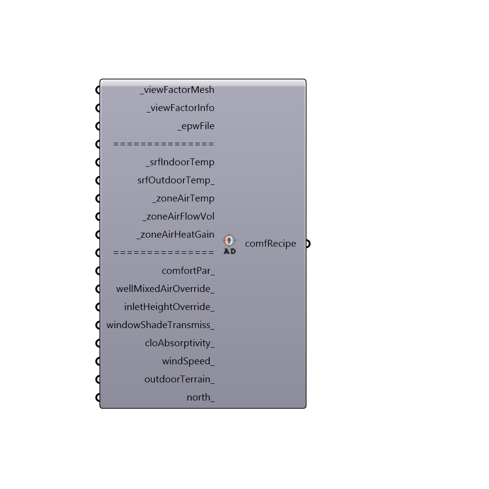

##  Adaptive Comfort Analysis Recipe

Use this component to assemble an adaptive comfort recipe for the "Honeybee_Annual Indoor Comfort Analysis" component.
 -
 

#### Inputs
* ##### viewFactorMesh [Required]
The data tree of view factor meshes that comes out of the  "Honeybee_Indoor View Factor Calculator".
* ##### viewFactorInfo [Required]
The python list that comes out of the  "Honeybee_Indoor View Factor Calculator".
* ##### epwFile [Required]
The epw file that was used to run the EnergyPlus model.  This will be used to generate sun vectors and get radiation data for estimating the temperature delta for sun falling on occupants.
* ##### srfIndoorTemp [Required]
A list surfaceIndoorTemp data out of the "Honeybee_Read EP Surface Result" component.
* ##### srfOutdoorTemp [Optional]
A list surfaceOutdoorTemp data out of the "Honeybee_Read EP Surface Result" component.
* ##### zoneAirTemp [Required]
The airTemperature output of the "Honeybee_Read EP Result" component.
* ##### zoneAirFlowVol [Required]
The airFlowVolume output of the "Honeybee_Read EP Result" component.
* ##### zoneAirHeatGain [Required]
The airHeatGainRate output of the "Honeybee_Read EP Result" component.
* ##### comfortPar [Optional]
Set to "True" to have the comfort standard be 80 percent of occupants comfortable and set to "False" to have the comfort standard be 90 percent of all occupants comfortable.  The default is set to "False" for 90 percent, which is what most members of the building industry aim for.  However some projects will occasionally use 90%.
* ##### wellMixedAirOverride [Optional]
Set to "True" if you know that your building will have a forced air system with diffusers meant to mix the air as well as possilbe.  This will prevent the calculation from running the air stratification function and instead assume well mixed conditions.  This input can also be a list of 8760 boolean values that represent the hours of the year when a forced air system or ceiling fans are run to mix the air.  The default is set to 'False' to run the stratification calculation for every hour of the year, assuming no forced air heating/cooling system.
* ##### inletHeightOverride [Optional]
An optional list of float values that match the data tree of view factor meshes and represent the height, in meters, from the bottom of the view factor mesh to the window inlet height.  This will override the default value used in the air stratification calculation, which sets the inlet height in the bottom half of the average glazing height.
* ##### windowShadeTransmiss [Optional]
A decimal value between 0 and 1 that represents the transmissivity of the shades on the windows of a zone (1 is no shade and 0 is fully shaded).  This input can also be a list of 8760 values between 0 and 1 that represents a list of hourly window shade transmissivities to be applied to all windows of the model. Finally and most importantly, this can be the 'windowTransmissivity' output of the 'Read EP Surface Result' component for an energy model that has been run with window shades.  This final option ensures that the energy model and the confort map results are always aligned although it is the most computationally expensive of the options.  The default is set to 0, which assumes no additional shading to windows.
* ##### cloAbsorptivity [Optional]
An optional decimal value between 0 and 1 that represents the fraction of solar radiation absorbed by the human body. The default is set to 0.7 for (average/brown) skin and average clothing.  You may want to increase this value for darker skin or darker clothing.
* ##### windSpeed [Optional]
A value in m/s to set the wind speed of the comfort calculation. Use this input to account for objects like ceiling fans that might increase the interior wind speed or input custom wind speed values from a CFD simulation.
 _
 This input can also be a list of 8760 additional wind speed values that represent the hours of the year.
 Alternatively, this input can be a data tree of values with branches that are each 8760 values long and correspond to the branches of the input viewFactorMesh_.
 This can also be a data tree of values with one branch for each point in the input viewFactorMesh_.
 Finally, this input can be the file path to a .csv file that is organized with 8760 values in each column and a number of columns that correspond to the number of test points.  This last option is recommended if trying to synchronize CFD results with the microclimate maps.
 _
 If no value is input here, the comfort map components will compute a minimum indoor air speed from the zone volume and hourly flow volume and will use the EPW wind speed for outdoor conditions.
* ##### outdoorTerrain [Optional]
An interger or text string that sets the terrain class associated with the wind speed used in outdoor wind calculations. Interger values represent the following terrain classes:
 0 = City: large city centres, 50% of buildings above 21m over a distance of at least 2000m upwind.
 1 = Suburban: suburbs, wooded areas.
 2 = Country: open, with scattered objects generally less than 10m high.
 3 = Water: Flat, unobstructed areas exposed to wind flowing over a large water body (no more than 500m inland).
* ##### north [Optional]
Input a vector to be used as a true North direction for the comfort analysis or a number between 0 and 360 that represents the degrees off from the y-axis to make North.  The default North direction is set to the Y-axis (0 degrees).

#### Outputs
* ##### comfRecipe
An analysis recipe for the "Honeybee_Annual Indoor Comfort Analysis" component.

[Check Hydra Example Files for Adaptive Comfort Analysis Recipe](https://hydrashare.github.io/hydra/index.html?keywords=Honeybee_Adaptive Comfort Analysis Recipe)