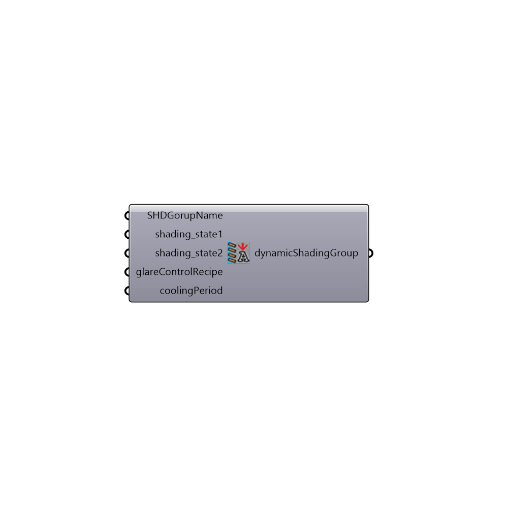

##  Advanced Dynamic Shading Recipe - [[source code]](https://github.com/mostaphaRoudsari/honeybee/tree/master/src/Honeybee_Advanced%20Dynamic%20Shading%20Recipe.py)

Advanced Shading Recipe for Annual Simulation with Daysim. This component prepares one shading group
 You need to add sensor points later in the Daysim result reader.
 -
 

#### Inputs
* ##### SHDGorupName []
SHDGorupName
* ##### shading_state1 []
Shading State1 The states should start from the most open state to the most closed state. Detailes description is available on Daysim website: http://daysim.ning.com/page/daysim-header-file-keyword-advanced-dynamic-shading
* ##### shading_state2 []
Shading State2 The states should start from the most open state to the most closed state. Detailes description is available on Daysim website: http://daysim.ning.com/page/daysim-header-file-keyword-advanced-dynamic-shading
* ##### glareControlRecipe []
Additional control for glare. Use Daysim glare control recipe to geneate the input
* ##### coolingPeriod []
Optional input for cooling priod. The blinds will be always down during the cooling period. Use Ladybug_Analysis Period component to create an input.

#### Outputs
* ##### dynamicShadingGroup
Dynamic shading group

[Check Hydra Example Files for Advanced Dynamic Shading Recipe](https://hydrashare.github.io/hydra/index.html?keywords=Honeybee_Advanced Dynamic Shading Recipe)