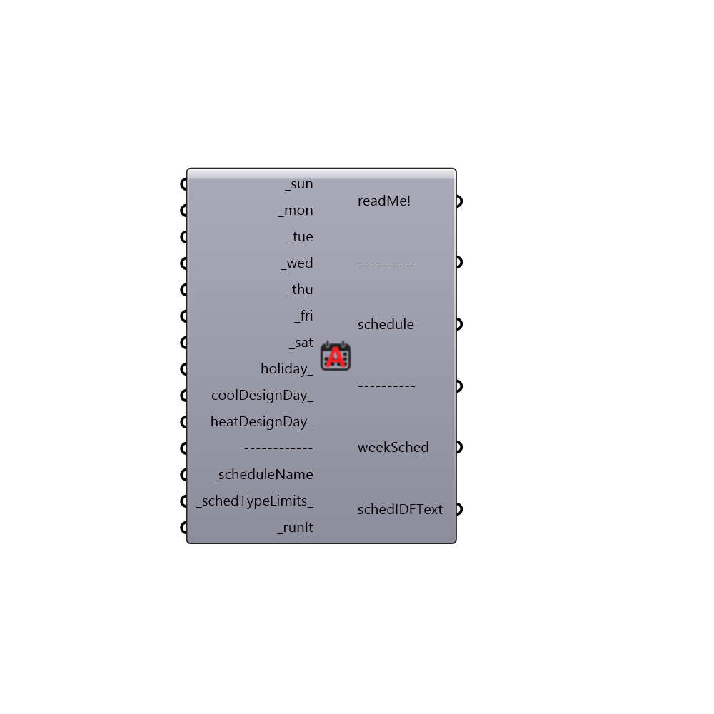

##  Annual Schedule

Use this component to generate values for Honeybee_Create CSV Schedule
 -
 Use this component to write schedules for EnergyPlus using LB_schedules as inputs.
 -
 

#### Inputs
* ##### sun [Required]
Sunday. Connect a list of 24 values that represent the schedule value at each hour of the day.
* ##### mon [Required]
Monday. Connect a list of 24 values that represent the schedule value at each hour of the day.
* ##### tue [Required]
Tuesday. Connect a list of 24 values that represent the schedule value at each hour of the day.
* ##### wed [Required]
Wednesday. Connect a list of 24 values that represent the schedule value at each hour of the day.
* ##### thu [Required]
Thursday. Connect a list of 24 values that represent the schedule value at each hour of the day..
* ##### fri [Required]
Friday. Connect a list of 24 values that represent the schedule value at each hour of the day.
* ##### sat [Required]
Saturday. Connect a list of 24 values that represent the schedule value at each hour of the day.
* ##### holiday [Optional]
Optional input for holidays. Connect a list of 24 values that represent the schedule value at each hour of the day.
* ##### epwFileForHol [Optional]
If you want to generate a list of holiday DOYs automatically connect an .epw file path on your system as a string.
* ##### overwriteHolidays [Optional]
Connect a list of DOYs (from 1 to 365) or a list of strings (example: DEC 25).
 -
 Note that this input overwrites epwFile DOYs.
* ##### startDayOfWeek [Optional]
Set the schedule start day of the week. The default is set to "monday".
 -
 Write one of the following string:
 1) sun
 2) mon
 3) tue
 4) wed
 5) thu
 6) fri
 7) sat
* ##### scheduleName [Default]
An optional name for the schedule that will be written to the memory of the document.  If no name is connected here, a uniqui ID will be generated for the schedule.
* ##### schedTypeLimits [Default]
A text string from the scheduleTypeLimits output of the "Honeybee_Call From EP Schedule Library" component.  This value represents the units of the schedule input values.  The default is "Fractional" for a schedule with values that range between 0 and 1.  Other common inputs include "Temperature", "On/Off", and "ActivityLevel".
* ##### generateValues [Required]
Set to "True" to generate hourly values of the schedule.
* ##### writeSchedule [Optional]
Set to "True to write the schedule to the Honeybee library such that you can assign the schedule with other Honeybee components.

#### Outputs
* ##### readMe!
...
* ##### schedule
The name of the schedule that has been written to the memory of the GH document.  Connect this to any shcedule input of a Honeybee component to assign the schedule.
* ##### holidays
Dates of the holydays.  Plug these into the holidays_ input of the "Honeybee_Energy Sim Par" component to have them counted as part of the simulation.
* ##### weekSchedule
The name of the weekly schedule that has been written to the memory of the GH document.  If your final intended annual schedule is composed of weeks with different schedule, you can use this output with the "Honeybee_Combined Annual Schedule" to create schedules with different weeks.
* ##### schedIDFText
Script variable AnnualSchedule
* ##### scheduleValues
The hourly schedulevalues for the entire year.  Connect these to the "Ladybug_3D Chart" component for a visual of the schedule.  If you would rather assign the schedule as a CSV schedule, you can also use these values with the "Honeybee_Create CSV Schedule" component to assign them as a csv schedule.  Note that CSV schedules will not appear in .osm files written by the OpenStudio component.

[Check Hydra Example Files for Annual Schedule](https://hydrashare.github.io/hydra/index.html?keywords=Honeybee_Annual Schedule)