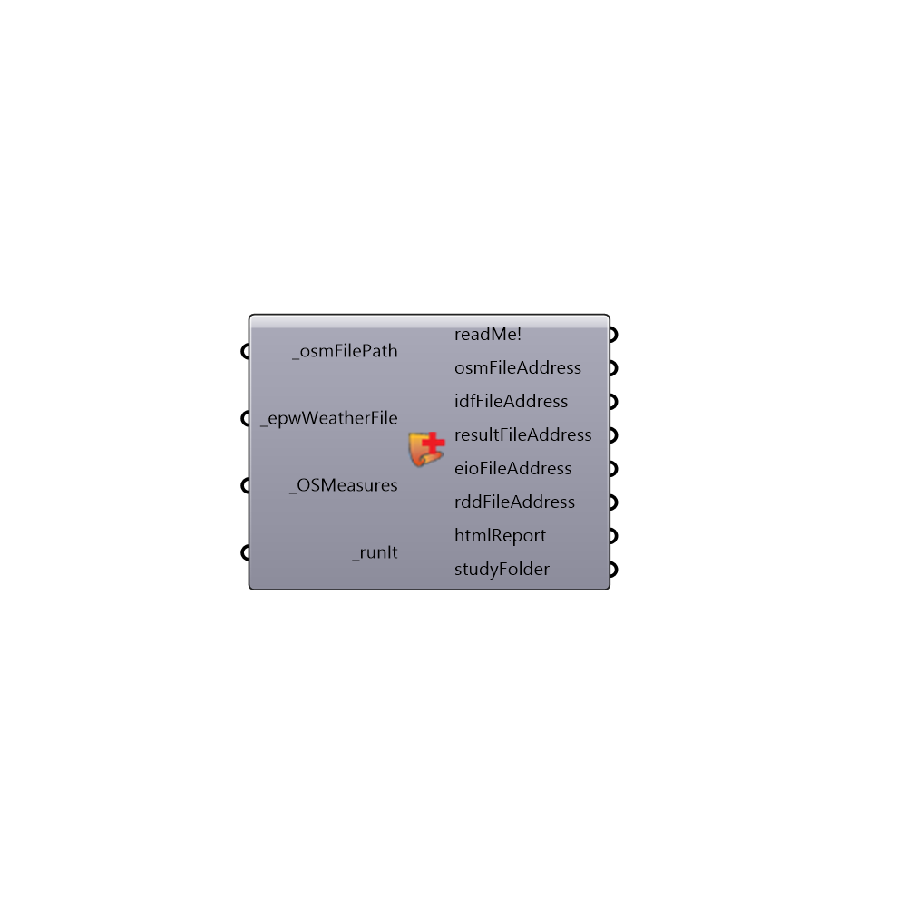

##  Apply OpenStudio Measure - [[source code]](https://github.com/ladybug-tools/honeybee-legacy/tree/master/src/Honeybee_Apply%20OpenStudio%20Measure.py)

This component applies an OpenStudio measure to an OpenStudio file. The component will eventually be integrated to Export to OpenStudio component.
 Read more about OpenStudio measures here: http://nrel.github.io/OpenStudio-user-documentation/reference/measure_writing_guide/
 You can download several measures from here: https://bcl.nrel.gov/nrel/types/measure
 Many thanks to NREL team for their support during the process. See (https://github.com/mostaphaRoudsari/Honeybee/issues/214) and (https://github.com/mostaphaRoudsari/Honeybee/issues/290)for just two examples!
 -
 

#### Inputs
* ##### osmFilePath [Required]
A file path of the an OpemStdio file
* ##### epwWeatherFile [Required]
An .epw file path on your system as a text string.
* ##### OSMeasures [Required]
Any number of OpenStudio measures that you want to apply to your OepnStudio model. Use the "Honeybee_Load OpenStudio Measure" component to load a measure into Grasshopper
* ##### runIt [Required]
Set to "True" to have the component generate an IDF file from the OSM file and run the IDF through through EnergyPlus.  Set to "False" to not run the file (this is the default).  You can also connect an integer for the following options:
 0 = Do Not Run OSM and IDF thrrough EnergyPlus
 1 = Run the OSM and IDF through EnergyPlus with a command prompt window that displays the progress of the simulation
 2 = Run the OSM and IDF through EnergyPlus in the background (without the command line popup window).
 3 = Generate an IDF from the OSM file but do not run it through EnergyPlus
 4 = Run the OSM and IDF through EnergyPlus using only OpenStudio CLI (note that there will be no resultFileAddress produced in this case).

#### Outputs
* ##### readMe!
...
* ##### osmFileAddress
The file path of the OSM file that has been generated on your machine.
* ##### idfFileAddress
The file path of the IDF file that has been generated on your machine. This file is only generated when you set "runSimulation_" to "True."
* ##### resultFileAddress
The file path of the CSV result file that has been generated on your machine.
* ##### eioFileAddress
The file path of the EIO file that has been generated on your machine.  This file contains information about the sizes of all HVAC equipment from the simulation.  This file is only generated when you set "runSimulation_" to "True."
* ##### rddFileAddress
The file path of the Result Data Dictionary (.rdd) file that is generated after running the file through EnergyPlus.  This file contains all possible outputs that can be requested from the EnergyPlus model.  Use the "Honeybee_Read Result Dictionary" to see what outputs can be requested.
* ##### htmlReport
Tthe file path to the HTML report that was generated after running the file through EnergyPlus.  Open this in a web browser for an overview of the energy model results.
* ##### studyFolder
The directory in which the simulation has been run.  Connect this to the 'Honeybee_Lookup EnergyPlus' folder to bring many of the files in this directory into Grasshopper.

[Check Hydra Example Files for Apply OpenStudio Measure](https://hydrashare.github.io/hydra/index.html?keywords=Honeybee_Apply OpenStudio Measure)