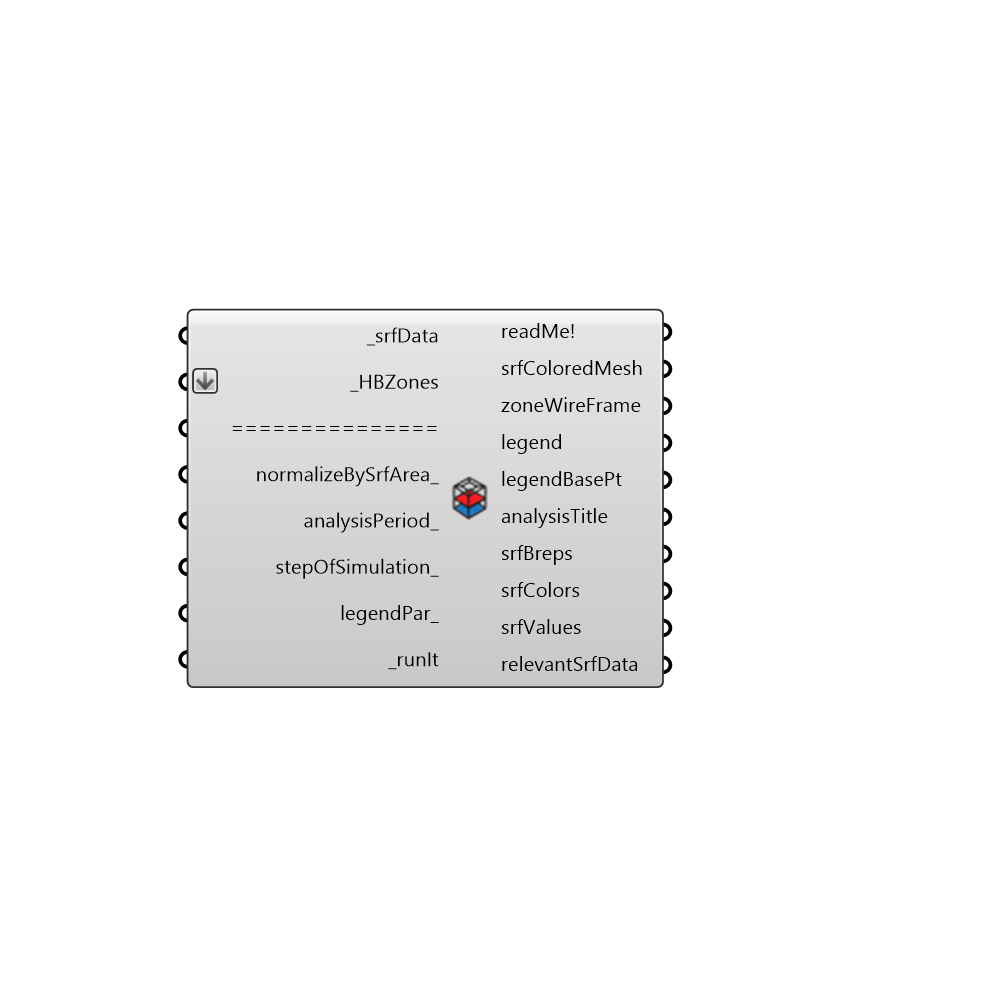

##  Color Surfaces by EP Result

Use this component to color zone surfaces based on EnergyPlus data out of the "Honeybee_Read EP Surface Result" component.
 _
 By default, zone surfaces will be colored based on total energy per unit surface area in the case of energy input data or colored based on average value of each surface in the case of temperature or data that is already normalized.
 If total annual simulation data has been connected, the analysisPeriod_ input can be used to select out a specific period fo the year for coloration.
 In order to color surfaces by individual hours/months, connecting interger values to the "stepOfSimulation_" will allow you to scroll though each step of the input data.
 -
 

#### Inputs
* ##### srfData [Required]
A list surface data out of the 'Honeybee_Read EP Surface Result' component.
* ##### HBZones [Required]
The HBZones out of any of the HB components that generate or alter zones.  Note that these should ideally be the zones that are fed into the Run Energy Simulation component as surfaces may not align otherwise.  Zones read back into Grasshopper from the Import idf component will not align correctly with the EP Result data.
* ##### analysisPeriod [Optional]
Optional analysisPeriod_ to take a slice out of an annual data stream.  Note that this will only work if the connected data is for a full year and the data is hourly.  Otherwise, this input will be ignored. Also note that connecting a value to 'stepOfSimulation_' will override this input.
* ##### stepOfSimulation [Optional]
Optional interger for the hour of simulation to color the surfaces with.  Connecting a value here will override the analysisPeriod_ input.
* ##### legendPar [Optional]
Optional legend parameters from the Ladybug Legend Parameters component.
* ##### recallHBHive [Optional]
Set to 'True' to recall the zones from the hive each time the input changes and 'False' to simply copy the zones to memory.  Calling the zones from the hive can take some more time but this is necessary if you are making changes to the zones and you want to check them.  Otherwise, if you are just scrolling through attributes, it is nice to set this to 'False' for speed.  The default is set to 'False' for speed.
* ##### runIt [Required]
Set boolean to 'True' to run the component and color the zone surfaces.

#### Outputs
* ##### readMe!
...
* ##### srfColoredMesh
A list of meshes for each surface, each of which is colored based on the input _srfData.
* ##### zoneWireFrame
A list of curves representing the outlines of the zones.  This is particularly helpful if one wants to scroll through individual meshes but still see the outline of the building.
* ##### legend
A legend of the surface colors. Connect this output to a grasshopper 'Geo' component in order to preview the legend spearately in the Rhino scene.
* ##### legendBasePt
The legend base point, which can be used to move the legend in relation to the building with the grasshopper 'move' component.
* ##### analysisTitle
The title of the analysis stating what the surfaces are being colored with.
* ##### srfBreps
A list of breps for each zone surface. Connecting this output and the following zoneColors to a Grasshopper 'Preview' component will thus allow you to see the surfaces colored transparently.
* ##### srfColors
A list of colors that correspond to the colors of each zone surface.  These colors include alpha values to make them slightly transparent.  Connecting the previous output and this output to a Grasshopper 'Preview' component will thus allow you to see the surfaces colored transparently.
* ##### srfValues
The values of the input data that are being used to color the surfaces.

[Check Hydra Example Files for Color Surfaces by EP Result](https://hydrashare.github.io/hydra/index.html?keywords=Honeybee_Color Surfaces by EP Result)