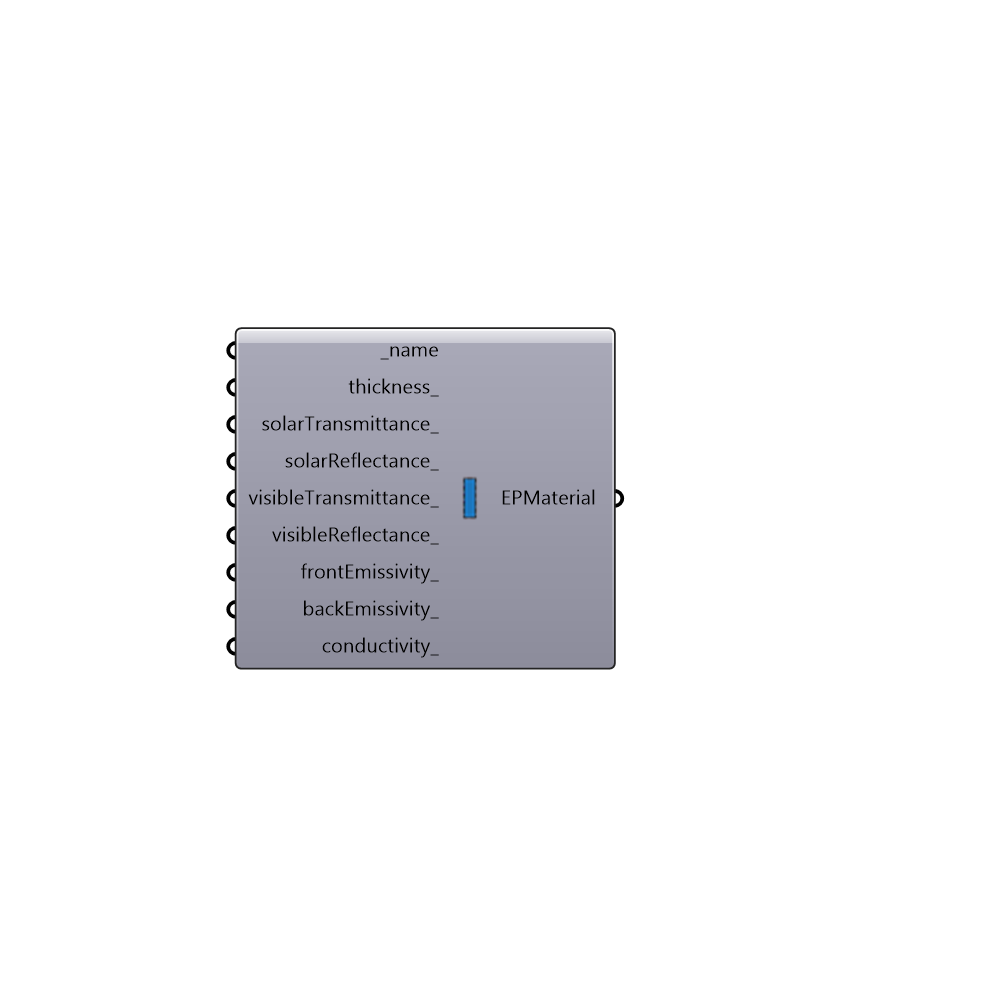

##  EnergyPlus Glass Material - [[source code]](https://github.com/mostaphaRoudsari/honeybee/tree/master/src/Honeybee_EnergyPlus%20Glass%20Material.py)

Use this component to create a custom material for glass, which can be plugged into the "Honeybee_EnergyPlus Construction" component.
 _
 It is important to note that this component creates a material that represents a single pane of glass, which can be combined with the "Honeybee_EnergyPlus Window Air Gap" to make multi-pane windows.  If you have specifications for a whole window element and not individual panes of glass and gas, you are better-off using the "Honeybee_EnergyPlus Window Material" component
 -
 

#### Inputs
* ##### name [Required]
A text name for your glass material.
* ##### thickness [Optional]
A number that represents the thickness of the pane of glass in meters.  The default is set to 0.003 meters (3 mm).
* ##### solarTransmittance [Optional]
A number between 0 and 1 that represents the transmittance of solar radiation through the glass at normal incidence.  The default is set to 0.837, which it typical for clear glass without a low-e coating.
* ##### solarReflectance [Optional]
A number between 0 and 1 that represents the reflectance of solar radiation off the glass at normal incidence.  The default is set to 0.075, which is typical for clear glass without a low-e coating.
* ##### visibleTransmittance [Optional]
A number between 0 and 1 that represents the transmittance of only visible light through the glass at normal incidence.  This is usally very close to the solarTransmittance_ for non-low-e-coated glass but can differ if the glass has a low-e coating. The default is set to 0.898, which is typical for clear glass without a low-e coating.
* ##### visibleReflectance [Optional]
A number between 0 and 1 that represents the reflectance of only visible light off the glass at normal incidence.  This is usally very close to the solarReflectance_ for non-low-e-coated glass but can differ if the glass has a low-e coating. The default is set to 0.081, which is typical for clear glass without a low-e coating.
* ##### frontEmissivity [Optional]
A number between 0 and 1 that represents the infrared hemispherical emissivity of the front (outdoor-facing) side of the glass.  This number is usually pretty high for non-low-e-coated glass but can be significantly lower for low-e coated glass.  The default is set to 0.84, which is typical for clear glass without a low-e coating.
* ##### backEmissivity [Optional]
A number between 0 and 1 that represents the infrared hemispherical emissivity of the back (indoor-facing) side of the glass.  This number is usually pretty high for non-low-e-coated glass but can be significantly lower for low-e coated glass.  The default is set to 0.84, which is typical for clear glass without a low-e coating.
* ##### conductivity [Optional]
A number representing the conductivity of the glass in W/m-K. The default is set to 0.9, which is typical for clear glass without a low-e coating.

#### Outputs
* ##### EPMaterial
A glass material that can be plugged into the "Honeybee_EnergyPlus Construction" component.

[Check Hydra Example Files for EnergyPlus Glass Material](https://hydrashare.github.io/hydra/index.html?keywords=Honeybee_EnergyPlus Glass Material)