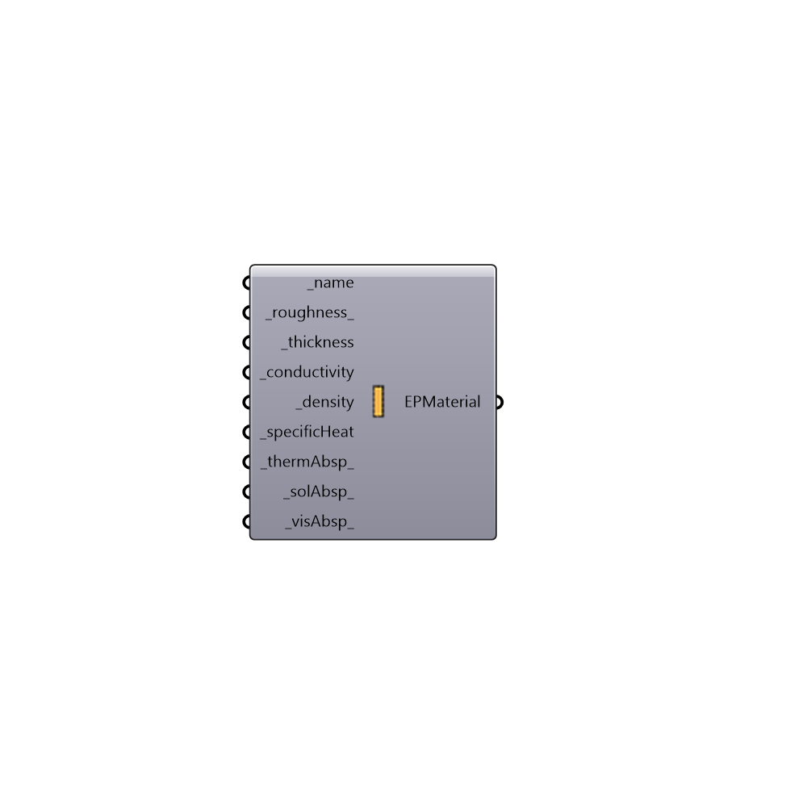

##  EnergyPlus Opaque Material - [[source code]](https://github.com/ladybug-tools/honeybee-legacy/tree/master/src/Honeybee_EnergyPlus%20Opaque%20Material.py)

Use this component to create a custom opaque material, which can be plugged into the "Honeybee_EnergyPlus Construction" component.
 _
 This component requires you to know a lot of the characteristics of the material and, you may want to borrow some characteristcs of a similar material in the library.  Use the "Honeybee_Call From EP Construction Library" and the "Honeybee_Decompose EP Material" to help with this.
 _
 If you are not able to find all of the necessary material characteristcs and your desired material is relatively light, it might be easier for you to use a "Honeybee_EnergyPlus NoMass Opaque Material."
 -
 

#### Inputs
* ##### name [Required]
A text name for your Opaque Material.
* ##### roughness [Default]
A text value that indicated the roughness of your material.  This can be either "VeryRough", "Rough", "MediumRough", "MediumSmooth", "Smooth", and "VerySmooth".  The default is set to "Rough".
* ##### thickness [Required]
A number that represents the thickness of the material in meters (m).
* ##### conductivity [Required]
A number representing the conductivity of the material in W/m-K.  This is essentially the heat flow in Watts across one meter thick of the material when the temperature difference on either side is 1 Kelvin.
* ##### density [Required]
A number representing the density of the material in kg/m3.  This is essentially the mass one cubic meter of the material.
* ##### specificHeat [Required]
A number representing the specific heat capacity of the material in J/kg-K.  This is essentially the number of joules needed to raise one kg of the material by 1 degree Kelvin.
* ##### thermAbsp [Default]
An number between 0 and 1 that represents the thermal abstorptance of the material.  The default is set to 0.9, which is common for most non-metallic materials.
* ##### solAbsp [Default]
An number between 0 and 1 that represents the abstorptance of solar radiation by the material.  The default is set to 0.7, which is common for most non-metallic materials.
* ##### visAbsp [Default]
An number between 0 and 1 that represents the abstorptance of visible light by the material.  The default is set to 0.7, which is common for most non-metallic materials.

#### Outputs
* ##### EPMaterial
An opaque material that can be plugged into the "Honeybee_EnergyPlus Construction" component.

[Check Hydra Example Files for EnergyPlus Opaque Material](https://hydrashare.github.io/hydra/index.html?keywords=Honeybee_EnergyPlus Opaque Material)