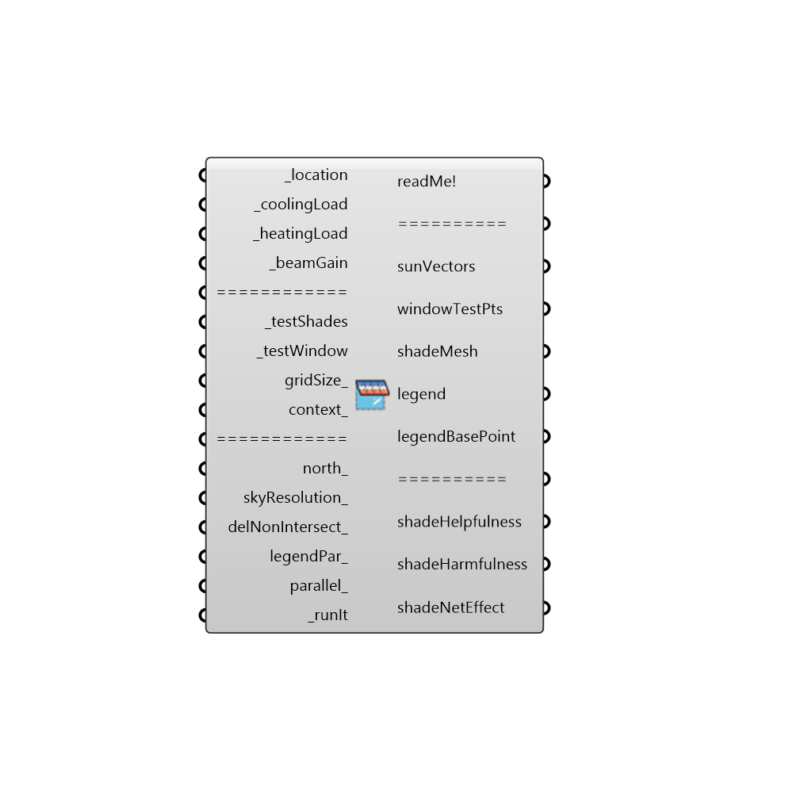

##  Energy Shade Benefit Evaluator - [[source code]](https://github.com/ladybug-tools/honeybee-legacy/tree/master/src/Honeybee_Energy%20Shade%20Benefit%20Evaluator.py)

This is a component for visualizing the desirability of shade in terms of energy simulation results by using solar vectors, the outdoor temperature, and the simulation hating load, cooling load, and beam gain.
 _
 Solar vectors for hours when the building is heating contribute positively to shade desirability while solar vectors for hours when the building is cooling contribute negatively.  This conrtibution is weighted by how much the building is cooling or heating in realtion to the solar beam gain through the window in question.
 _
 The component outputs a colored mesh of the shade illustrating the net effect of shading each mesh face.  A higher saturation of blue indicates that shading the cell is very desirable.  A higher saturation of red indicates that shading the cell is harmful (blocking more winter sun than summer sun). Desaturated cells indicate that shading the cell will have relatively little effect on outdoor comfort or building performance.
 _
 The units for shade desirability are net kWh saved per unit area of shade if the test cell is blue.  If the test cell is red, the units are net heating kWh harmed per unit area of shade.
 _
 The method used by this component is based off of the Shaderade method developed by Christoph Reinhart, Jon Sargent, Jeffrey Niemasz.  This component uses Shaderade's method for evaluating shade and window geometry in terms of solar vectors.
 _
 A special thanks goes to them and their research.  A paper detailing the Shaderade method is available at:
 http://web.mit.edu/tito_/www/Publications/BS2011_Shaderade.pdf
 -
 

#### Inputs
* ##### location [Required]
The output from the importEPW or constructLocation component.  This is essentially a list of text summarizing a location on the earth.
* ##### coolingLoad [Required]
The hourly cooling load of the window's corresponding zone (including ladybug header).
* ##### heatingLoad [Required]
The hourly heating load of the window's corresponding zone (including ladybug header).
* ##### beamGain [Required]
The hourly beam gain through the window (including ladybug header).
* ##### testShades [Required]
A Brep representing the shade to be evaluated for its benefit.
* ##### testWindow [Required]
A brep representing a window for which shading is being considered. Note that only breps with a single surface are supported now and volumetric breps will be included at a later point.
* ##### gridSize [Optional]
The length of each of the shade's test cells in model units.  Please note that, as this value gets lower, simulation times will increase exponentially even though this will give a higher resolution of shade benefit.
* ##### context [Optional]
If there is static external context that could block sun vectors at certain hours, connect context breps here to account for them in the shade benefit evaluation. 
* ##### north [Optional]
Input a vector to be used as a true North direction for the sun path or a number between 0 and 360 that represents the degrees off from the y-axis to make North.  The default North direction is set to the Y-axis (0 degrees).
* ##### skyResolution [Optional]
An interger equal to 0 or above to set the number of times that the tergenza sky patches are split.  A higher number will ensure a greater accuracy but will take longer.  At a sky resolution of 4, each hour's temperature is essentially matched with an individual sun vector for that hour.  At a resolution of 5, a sun vector is produced for every half-hour, at 6, every quarter hour, and so on. The default is set to 4, which should be high enough of a resolution to produce a meaningful reault in all cases.
* ##### delNonIntersect [Optional]
Set to "True" to delete mesh cells with no intersection with sun vectors.  Mesh cells where shading will have little effect because an equal amount of warm and cool temperature vectors will still be left in white.
* ##### legendPar [Optional]
Legend parameters that can be used to re-color the shade, change the high and low boundary, or sync multiple evaluated shades with the same colors and legend parameters.
* ##### parallel [Optional]
Set to "True" to run the simulation with multiple cores.  This can increase the speed of the calculation substantially and is recommended if you are not running other big or important processes.
* ##### runIt [Required]
Set to 'True' to run the simulation.

#### Outputs
* ##### readMe!
...
* ##### sunVectors
The sun vectors that were used to evaluate the shade (note that these will increase as the sky desnity increases).
* ##### windowTestPts
Points across the window surface from which sun vectors will be projected
* ##### shadeMesh
A colored mesh of the _testShades showing where shading is helpful (in satuated blue), harmful (in saturated red), or does not make much of a difference (white or desaturated colors).
* ##### legend
Legend showing the numeric values of degree-days that correspond to the colors in the shade mesh.
* ##### legendBasePoint
Script variable Shade Benefit
* ##### shadeHelpfulness
The cumulative kWh/m2 of building operational energy helped by shading the given cell.
* ##### shadeHarmfulness
The cumulative kWh/m2 of building operational energy harmed by shading the given cell.  Note that these values are all negative due to the fact that the shade is harmful. 
* ##### shadeNetEffect
The sum of the helpfulness and harmfulness for each cell.  This will be negative if shading the cell has a net harmful effect and positive if the shade has a net helpful effect.  Values are in kWh/m2 of building operational energy helped/harmed by shading the given cell.

[Check Hydra Example Files for Energy Shade Benefit Evaluator](https://hydrashare.github.io/hydra/index.html?keywords=Honeybee_Energy Shade Benefit Evaluator)