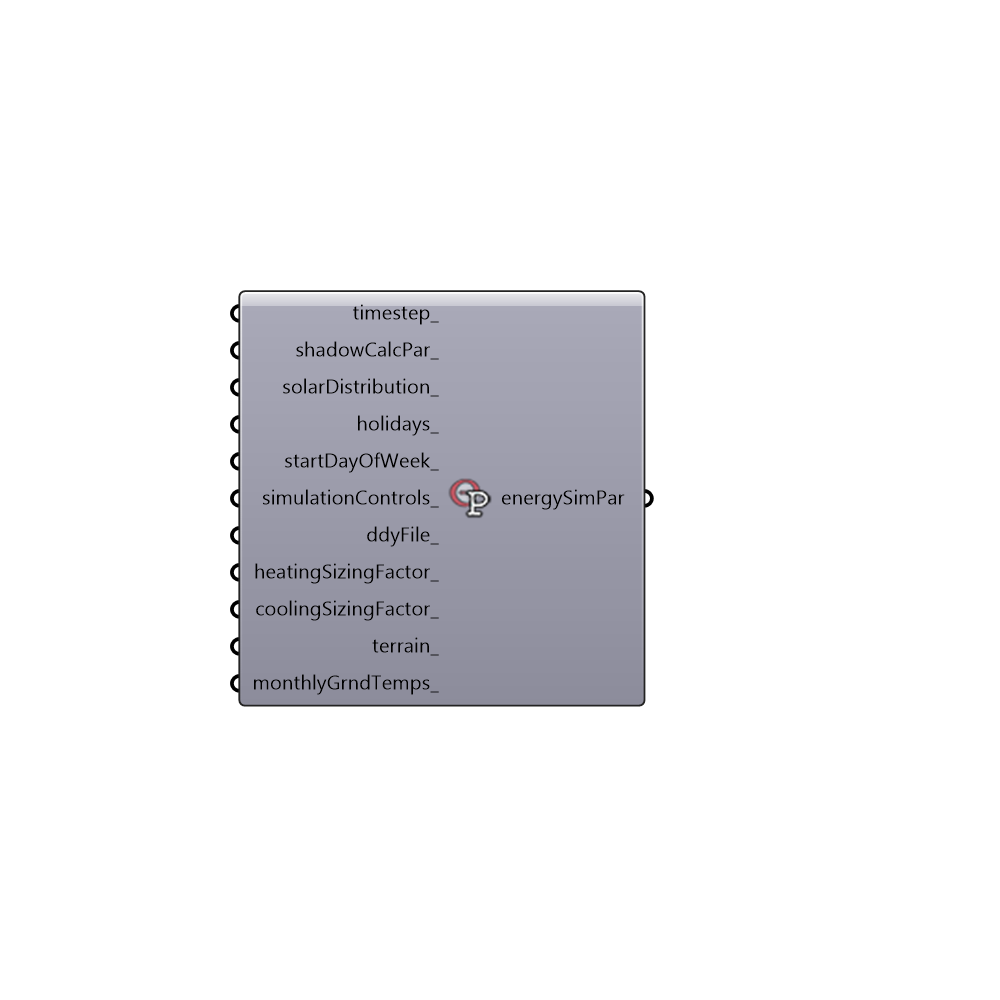

##  Energy Simulation Par

EnergyPlus Shadow Parameters
 -
 

#### Inputs
* ##### timestep [Optional]
A number between 1 and 60 that represents the number of timesteps per hour at which the simulation will be run.  The default is set to 6 timesteps per hour, which means that the energy balance calculation is run every 10 minutes of the year.
* ##### shadowCalcPar [Optional]
An optional set of shadow calculation parameters from the "Honeybee_ShadowPar" component.
* ##### solarDistribution [Optional]
An optional text string or integer that sets the solar distribution calculation.  Choose from the following options:
 0 = "MinimalShadowing" - In this case, exterior shadowing is only computed for windows and not for other opaque surfaces that might have their surface temperature affected by the sun. All beam solar radiation entering the zone is assumed to fall on the floor. A simple window view factor calculation will be used to distribute incoming diffuse solar energy between interior surfaces.
 1 = "FullExterior" - The simulation will perform the solar calculation in a manner that only accounts for direct sun and whether it is blocked by surrounding context geometry.  For the inside of the building, all beam solar radiation entering the zone is assumed to fall on the floor. A simple window view factor calculation will be used to distribute incoming diffuse solar energy between interior surfaces.
 2 = "FullInteriorAndExterior" - The simulation will perform the solar calculation in a manner that models the direct sun (and wheter it is blocked by outdoor context goemetry.  It will also ray trace the direct sun on the interior of zones to distribute it correctly between interior surfaces.  Any indirect sun or sun bouncing off of objects will not be modled.
 3 = "FullExteriorWithReflections" - The simulation will perform the solar calculation in a manner that accounts for both direct sun and the light bouncing off outdoor surrounding context.  For the inside of the building, all beam solar radiation entering the zone is assumed to fall on the floor. A simple window view factor calculation will be used to distribute incoming diffuse solar energy between interior surfaces.
 4 = "FullInteriorAndExteriorWithReflections" - The simulation will perform the solar calculation in a manner that accounts for light bounces that happen both outside and inside the zones.  This is the most accurate method and is the one assigned by default.  Note that, if you use this method, EnergyPlus will give Severe warnings if your zones have concave geometry (or are "L"-shaped).  Such geometries mess up this solar distribution calculation and it is recommeded that you either break up your zones in this case or not use this solar distribution method.
* ##### holidays [Optional]
A list of numbers, each between 1 and 365, that represent the days of the year on which a holiday occurs.  This can be the holiday output from the "Honeybee_Annual Schedule" component.
* ##### startDayOfWeek [Optional]
An integer that represents the day of the week for the first day of the year. The default is set to 2 - "monday".
 -
 Choose one of the following:
 1) sun
 2) mon
 3) tue
 4) wed
 5) thu
 6) fri
 7) sat
* ##### simulationControls [Optional]
An optional set of simulation controls from the "Honeybee_Simulation Control" component.
* ##### ddyFile [Optional]
An optional file path to a .ddy file on your system.  This ddy file will be used to size the HVAC system before running the simulation.
* ##### heatingSizingFactor [Optional]
An optional number that represents the 'saftey factor' to which the heating system will be sized.  A sizing factor of 1 means that the system is sized to perfectly meet the design day conditions.  The default is set to 1.25 as it is usually appropriate to oversize the system slightly to ensure that there are no unmet hours.  Specifying a factor here that is below 1.25 can result in more hours that do not meet the heating setpoint.
* ##### coolingSizingFactor [Optional]
An optional number that represents the 'saftey factor' to which the cooling system will be sized.  A sizing factor of 1 means that the system is sized to perfectly meet the design day conditions.  The default is set to 1.15 as it is usually appropriate to oversize the system slightly to ensure that there are no unmet hours.  Specifying a factor here that is below 1.15 can result in more hours that do not meet the cooling setpoint.
* ##### terrain [Optional]
An optional integer or text string to set the surrouning terrain of the building, which will be used to determine how wind speed around the building changes with height.  If no value is input here, the default is set to "City."  Choose from the following options:
 0 = City: large city centres, 50% of buildings above 21m over a distance of at least 2000m upwind.
 1 = Suburbs: suburbs, wooded areas.
 2 = Country: open, with scattered objects generally less than 10m high.
 3 = Ocean: Flat, unobstructed areas exposed to wind flowing over a large water body (no more than 500m inland).
* ##### monthlyGrndTemps [Optional]
An optional list of 12 monthly ground temperatures to be used by those surfaces in contact with the ground in the simulation.  Please note that the EPW values out of the Import Ground Temp component are usually too extreme for a conditioned building.  If no values are input here, the model will attempt to estimate a reasonable starting base temperature from these results by using a value of 18C in cases of monthly ground temperatures below 18C, 24C in cases of monthly ground temperatures above 24C, and the actual ground temperature if the monthly average falls in between 18C and 24C.  Usually, ground temperatures will be about 2C lower than the overage indoor air temperature for a given month.

#### Outputs
* ##### energySimPar
Energy simulation parameters that can be plugged into the "Honeybee_ Run Energy Simulation" component.

[Check Hydra Example Files for Energy Simulation Par](https://hydrashare.github.io/hydra/index.html?keywords=Honeybee_Energy Simulation Par)