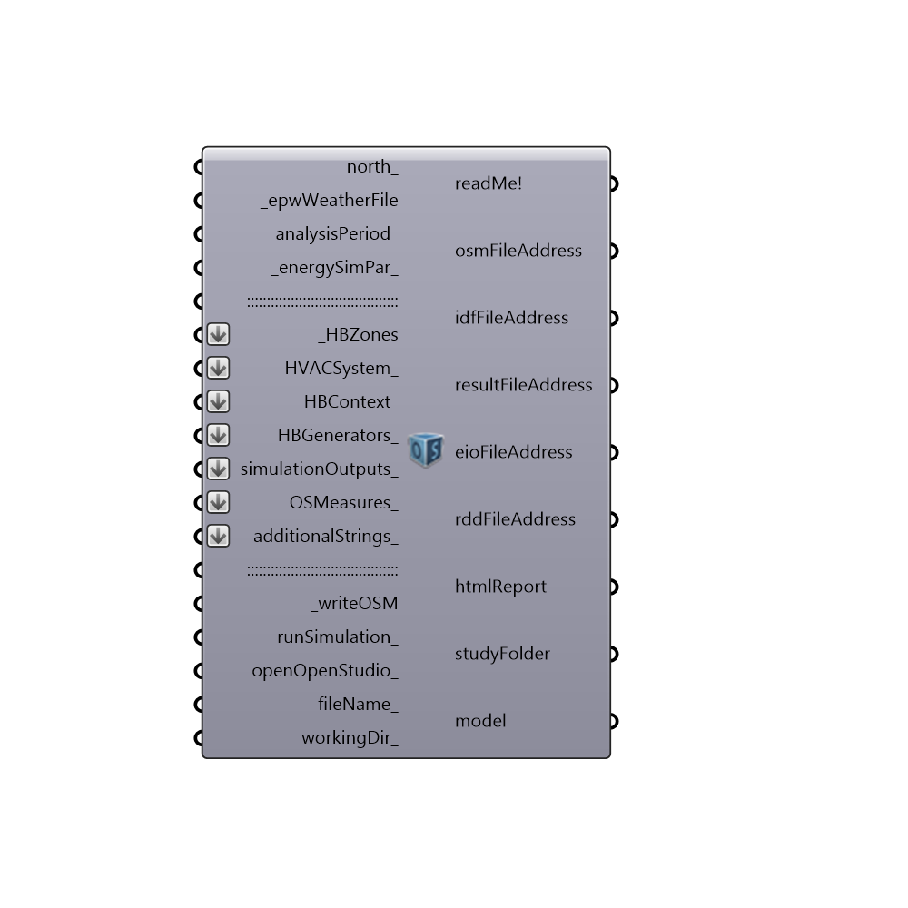

##  Export To OpenStudio

Use this component to export HBZones into an OpenStudio file, and run them through EnergyPlus.
 _
 The component outputs the report from the simulation, the file path of the IDF file, and the CSV result file from the EnergyPlus run, and two other result files that record outputs in different formats.
 -
 

#### Inputs
* ##### north [Optional]
Input a vector to be used as a true North direction for the energy simulation or a number between 0 and 360 that represents the degrees off from the y-axis to make North.  The default North direction is set to the Y-axis (0 degrees).
* ##### epwWeatherFile [Required]
An .epw file path on your system as a text string.
* ##### analysisPeriod [Default]
An optional analysis period from the Ladybug_Analysis Period component.  If no Analysis period is given, the energy simulation will be run for the enitre year.
* ##### energySimPar [Default]
Optional Energy Simulation Parameters from the "Honeybee_Energy Simulation Par" component.  If no value is connected here, the simulation will run with the following parameters:
 1 - 6 timeSteps per hour
 2 - A shadow calculation that averages over multiple days (as opposed to running it for each timeStep)
 3 - A shadow calculation frequency of 30 (meaning that the shadow calulation is averaged over every 30 days)
 4 - A maximum of 3000 points used in the shadow calculation. (This may need to be higher if you have a lot of detailed context geometry)
 5 - An colar energy calculation that includes both interior and exterior light reflections.
 6 - A simulation including a zone sizing calculation, a system sizing calculation, a plat sizing calculation, and a full run of the energy use ofver the analysis period.  The simulation is not run for the sizing period by default.
 7 - A system sizing period that runs from the extreme periods of the weather file and not a ddy file.
 8 - City terrian.
* ##### HBZones [Required]
The HBZones that you wish to write into an OSM file and/or run through EnergyPlus.  These can be from any of the components that output HBZones.
* ##### HBContext [Optional]
Optional HBContext geometry from the "Honeybee_EP Context Surfaces." component.
* ##### simulationOutputs [Optional]
A list of the outputs that you would like EnergyPlus to write into the result CSV file.  This can be any set of any outputs that you would like from EnergyPlus, writen as a list of text that will be written into the IDF.  It is recommended that, if you are not expereinced with writing EnergyPlus outputs, you should use the "Honeybee_Write EP Result Parameters" component to request certain types of common outputs. 
* ##### additionalStrings [Optional]
THIS OPTION IS JUST FOR ADVANCED USERS OF ENERGYPLUS.  You can input additional text strings here that you would like written into the IDF.  The strings input here should be complete EnergyPlus objects that are correctly formatted.  You can input as many objects as you like in a list.  This input can be used to write objects into the IDF that are not currently supported by Honeybee.
* ##### writeOSM [Required]
Set to "True" to have the component take your HBZones and other inputs and write them into an OSM file.  Note that only setting this to "True" and not setting the output below to "True" will not automatically run the file through EnergyPlus for you.
* ##### runSimulation [Optional]
Set to "True" to have the component generate an IDF file from the OSM file and run the IDF through through EnergyPlus.  Set to "False" to not run the file (this is the default).  You can also connect an integer for the following options:
 0 = Do Not Run OSM and IDF thrrough EnergyPlus
 1 = Run the OSM and IDF through EnergyPlus with a command prompt window that displays the progress of the simulation
 2 = Run the OSM and IDF through EnergyPlus in the background (without the command line popup window).
 3 = Generate an IDF from the OSM file but do not run it through EnergyPlus
* ##### openOpenStudio [Optional]
Set to "True" to open the OSM file in the OpenStudio interface.  This is useful if you want to visualize the HVAC system in OpenStudio, you want to edit the HVAC further in OpenStudio, or just want to run the simulation from OpenStudio instead of Rhino/GH.  Note that, for this to work, you must have .osm files associated with the OpenStudio application.
* ##### fileName [Optional]
Optional text which will be used to name your OSM, IDF and result files.  Change this to aviod over-writing results of previous energy simulations.
* ##### workingDir [Optional]
An optional working directory to a folder on your system, into which your OSM, IDF and result files will be written.  NOTE THAT DIRECTORIES INPUT HERE SHOULD NOT HAVE ANY SPACES OR UNDERSCORES IN THE FILE PATH.

#### Outputs
* ##### readMe!
Check here to see a report of the EnergyPlus run, including errors.
* ##### osmFileAddress
The file path of the OSM file that has been generated on your machine.
* ##### idfFileAddress
The file path of the IDF file that has been generated on your machine. This only happens when you set "runSimulation_" to "True."
* ##### resultsFileAddress
Script variable exportToOpenStudio
* ##### rddFileAddress
The file path of the Result Data Dictionary (.rdd) file that is generated after running the file through EnergyPlus.  This file contains all possible outputs that can be requested from the EnergyPlus model.  Use the "Honeybee_Read Result Dictionary" to see what outputs can be requested.
* ##### studyFolder
The directory in which the simulation has been run.  Connect this to the 'Honeybee_Lookup EnergyPlus' folder to bring many of the files in this directory into Grasshopper.

[Check Hydra Example Files for Export To OpenStudio](https://hydrashare.github.io/hydra/index.html?keywords=Honeybee_Export To OpenStudio)