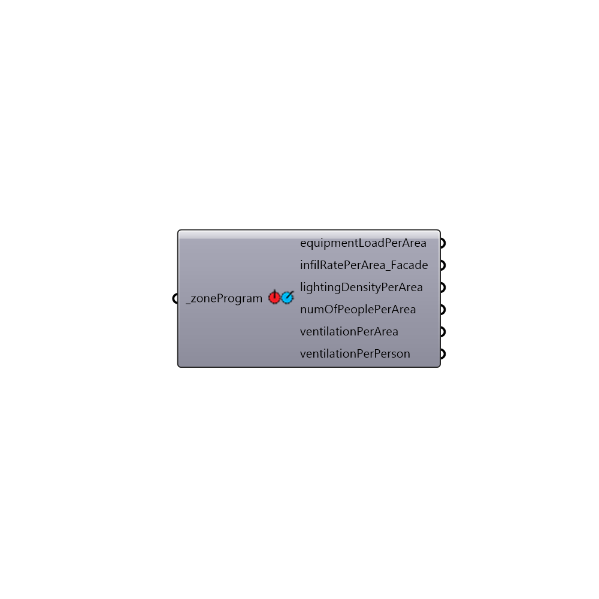

##  Get EnergyPlus Loads - [[source code]](https://github.com/ladybug-tools/honeybee-legacy/tree/master/src/Honeybee_Get%20EnergyPlus%20Loads.py)

Look up loads for an specific bldgProgram and zoneProgram
 -
 

#### Inputs
* ##### zoneProgram [Required]
Script input _zoneProgram.

#### Outputs
* ##### equipmentLoadPerArea
The desired equipment load per square meter of floor.  Values here should be in W/m2 (Watts per square meter).  Typical values can range from 2 W/m2 (for just a laptop or two in the zone) to 15 W/m2 for an office filled with computers and appliances.
* ##### infilRatePerArea_Facade
The desired rate of outside air infiltration into the zone per square meter of exterior facade.  Values here should be in m3/s-m2 @4Pa(Cubic meters per second per square meter of exterior facade).  ASHRAE recommends the following general infiltration rates based on the area of the facade exposed to the outdoors:
 ------------------------------------------------------------
 Unit of following reference numbers:
 m3/s per m2 facade @4Pa
 ------------------------------------------------------------
 0.000071 - Passive house         (0.1 cfm/sf facade @75Pa)
 0.0001 - Tight building               (0.14 cfm/sf facade @75Pa)
 0.000285 - ASHRAE 90.1-2013 (0.4 cfm/sf facade @75Pa)
 0.0003 - Average building          (0.42 cfm/sf facade @75Pa)
 0.0006 - Leaky building             (0.84 cfm/sf facade @75Pa)
* ##### lightingDensityPerArea
The desired lighting load per square meter of floor.  Values here should be in W/m2 (Watts per square meter).  Typical values can range from 3 W/m2 for efficeint LED bulbs to 15 W/m2 for incandescent heat lamps.
* ##### numOfPeoplePerArea
The desired number of per square meter of floor at peak occupancy.  Values here should be in ppl/m2 (People per square meter).  Typical values can range from 0.02 ppl/m2 for a lightly-occupied household to 0.5 ppl/m2 for a tightly packed auditorium.
* ##### ventilationPerArea
The desired minimum rate of outdoor air ventilation through the mechanical system into the zone in m3/s per m2 of floor.  Values here should be in m3/s-m2 (Cubic meters per second per square meter of floor).  Often, this total value over the zone should be much lower than the ventilation per person (below).  Typical values can range from 0.0002 m3/s-m2 for lightly-occupied houses to 0.0025 m3/s-m2 for spaces like laboratories and cleanrooms where dust contamination is a major concern.
* ##### ventilationPerPerson
The desired minimum rate of outdoor air ventilation through the mechanical system into the zone per person in the zone.  Values here should be in m3/s-person (Liters per second per person in the zone). In effect, an input here will mimic demand controlled ventilation, where the ventilation through the mechanical system will change depending upon the occupancy. Most standards suggest that you should have at least 0.001 m3/s for each person in the zone but this may be increased sometimes to avoid odors or exposure to indoor pollutants.

[Check Hydra Example Files for Get EnergyPlus Loads](https://hydrashare.github.io/hydra/index.html?keywords=Honeybee_Get EnergyPlus Loads)