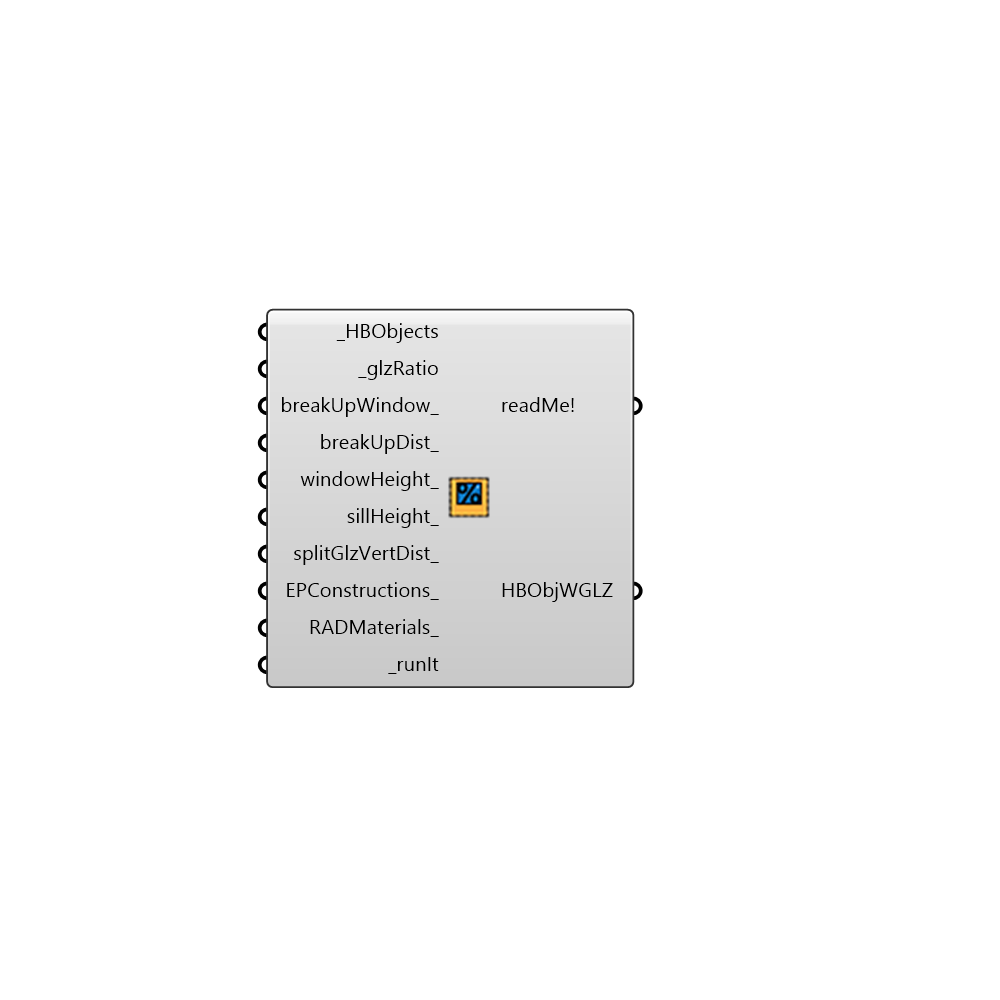

##  Glazing based on ratio - [[source code]](https://github.com/mostaphaRoudsari/honeybee/tree/master/src/Honeybee_Glazing%20based%20on%20ratio.py)

Use this component to generate windows for a HBSurface or HBZone based on a desired window-to-wall ratio. In addition to generating window geometry that corresponds with the input ratio, this component also allows you a fairly high level of control over the window geometry.
 _
 The first way in which you gain additional control over geometry is the option of whether you want to generate a single window for each surface, which is good for making energy simulations run fast, or you want to use the glazig ratio to create several windows distributed across the surfaces, which is often necessary to have accurate daylight simulations or high-resolution thermal maps.
 If you break up the window into several ones, you also have the ability to set the distance between each of the windows along the surface.
 _
 If you input wall surfaces that have perfectly horizontal tops and/or bottoms, you also have access to a number of other other inputs such as window height, the sill height, and whether you want to split the glazing vertically into two windows.
 -
 

#### Inputs
* ##### HBObjects [Required]
Honeybee thermal zones or surfaces for which glazing should be generated.
* ##### glzRatio [Required]
The fraction of the wall surface that should be glazed.  This input only accepts values between 0 and 0.95 (we don't go all of the way up to 1 because EnergyPlus does not like this).  This input can also accept lists of values and will assign different glazing ratios based on cardinal direction, starting with north and moving counter-clockwise.  Note that glazing ratio always takes priority over the windowHeight and sillHeight inputs below.
* ##### breakUpWindow [Optional]
Set to "True" to generate a distributed set of multiple windows on walls and set to "False" to generate just a single window per rectangular wall surface.  This input can also accept lists of boolean values and will assign different 'BreakUpWindow' values based on cardinal direction, starting with north and moving counter-clockwise.  A single window for each surface is good for making energy simulations run fast while several distributed windows is often necessary to have accurate daylight simulations or high-resolution thermal maps. The default is set to "True" to generate multiple distributed windows.
* ##### breakUpDist [Optional]
An optional number in Rhino model units that sets the distance between individual windows on rectangular surfaces when the breakUpWindow_ input above is set to 'True'.  This input can also accept lists of values and will assign different sill heights based on cardinal direction, starting with north and moving counter-clockwise.  Note that this input will be over-ridden at high glazing ratios or window heights.  The default is set to 2 meters.
* ##### windowHeight [Optional]
An optional number in Rhino model units that sets the height of your windows on rectangular surfaces when the breakUpWindow_ input above is set to 'True'.  This input can also accept lists of values and will assign different window heights based on cardinal direction, starting with north and moving counter-clockwise.  Note that this input will be over-ridden at high glazing ratios. The default is set to 2 meters.
* ##### sillHeight [Optional]
An optional number in Rhino model units that sets the distance from the floor to the bottom of your windows on rectangular surfaces when the breakUpWindow_ input above is set to 'True'.  This input can also accept lists of values and will assign different sill heights based on cardinal direction, starting with north and moving counter-clockwise.  Note that this input will be over-ridden at high glazing ratios or window heights.  The default is set to 0.8 meters (or 80 centimeters).
* ##### splitGlzVertDist [Optional]
An optional number in Rhino model units that splits the windows on rectangular surfaces into two with a vertical distance between them equal to this input when the breakUpWindow_ input above is set to 'True'.  This input can also accept lists of values and will assign different vertical distances based on cardinal direction, starting with north and moving counter-clockwise.  Note that this input will be over-ridden at high glazing ratios, high window heights, or high sill heights.
* ##### EPConstructions [Optional]
A optional text string of an EnergyPlus construction name that sets the material construction of the window. This input can also accept lists of values and will assign different EPconstructions based on cardinal direction, starting with north and moving counter-clockwise.  The default will assign a generic double pane window without low-e coatings.
* ##### RADMaterials [Optional]
A optional text string of an Radiance glass material name that sets the material of the window. This input can also accept lists of values and will assign different RadMaterials based on cardinal direction, starting with north and moving counter-clockwise.
* ##### runIt [Required]
set runIt to True to generate the glazing

#### Outputs
* ##### readMe!
...
* ##### HBObjWGLZ
Newhoneybee zones that contain glazing surfaces based on the parameters above. 

[Check Hydra Example Files for Glazing based on ratio](https://hydrashare.github.io/hydra/index.html?keywords=Honeybee_Glazing based on ratio)