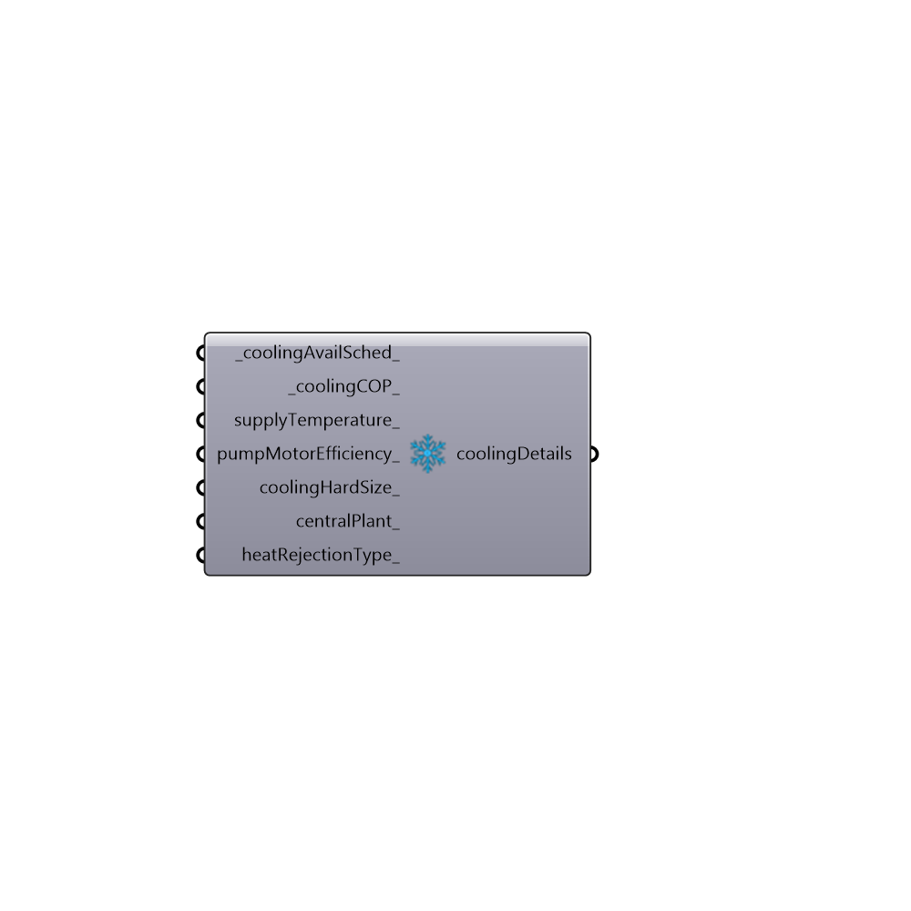

##  HVAC Cooling Details

Use this component to set the parameters of a HVAC cooling system that has been assigned with the "Honeybee_HVAC Systems" component.
 _
 Not all of the inputs on this component are assignable features of all HVAC systems.  However, most HVAC systems have these features and, if you assign a parameter that is not usable by a certain HVAC system, the "Honeybee_OpenStudio Systems" component will give you a warning to let you know.
 -
 

#### Inputs
* ##### coolingAvailSched [Default]
A text string representing the availability shcedule of the cooling system.  This can be either a shcedule from the schedule libirary or a CSV file path to a CSV schedule you created with the "Honeybee_Create CSV Schedule" component.  The default is set to 'ALWAYS ON.'
* ##### coolingCOP [Default]
A number (typically greater than 1) that sets the reference coefficient of performance (COP) of the primary cooling component (under design-day conditions). The COP is the ratio of heat removed by the cooling system per unit of electricity input.  For a large HVAC system, this input refers to the COP of the chiller compressor.  For a smaller system, this likely refers to the COP of the direct expansion cooling coil or equivalent.  Defaults range from 2 to 5.5 depending on the system type.
* ##### supplyTemperature [Optional]
A number representing the temperature of the water leaving the chiller in degrees Celsius.  This input does not have an effect on direct expansion cooling systems.  If left blank, the default temperature is usually 6.67 degrees Celsius.
* ##### pumpMotorEfficiency [Optional]
A number between 0 and 1 that represents the motor efficiency of the chilled water pump.  This input does not have an effect on direct expansion cooling systems.  If left blank, the defualt efficiency is usally 0.9.
* ##### chillerType [Optional]
An integer or boolean (0/1) value that represents the type of chiller used.  This input does not have an effect on direct expansion cooling systems.  If left blank, the defualt efficiency is usally 0 = water cooled.  Choose from the following options:
 0 = Water Cooled - The chiller will be cooled using a condenser water loop with cooling tower and will use a higher default COP.
 1 = Air Cooled - The chiller will reject heat directly to the air and will have a lower default COP.

#### Outputs
* ##### coolingDetails
A description of the cooling system features, which can be plugged into "Honeybee_HVAC Systems" component.

[Check Hydra Example Files for HVAC Cooling Details](https://hydrashare.github.io/hydra/index.html?keywords=Honeybee_HVAC Cooling Details)