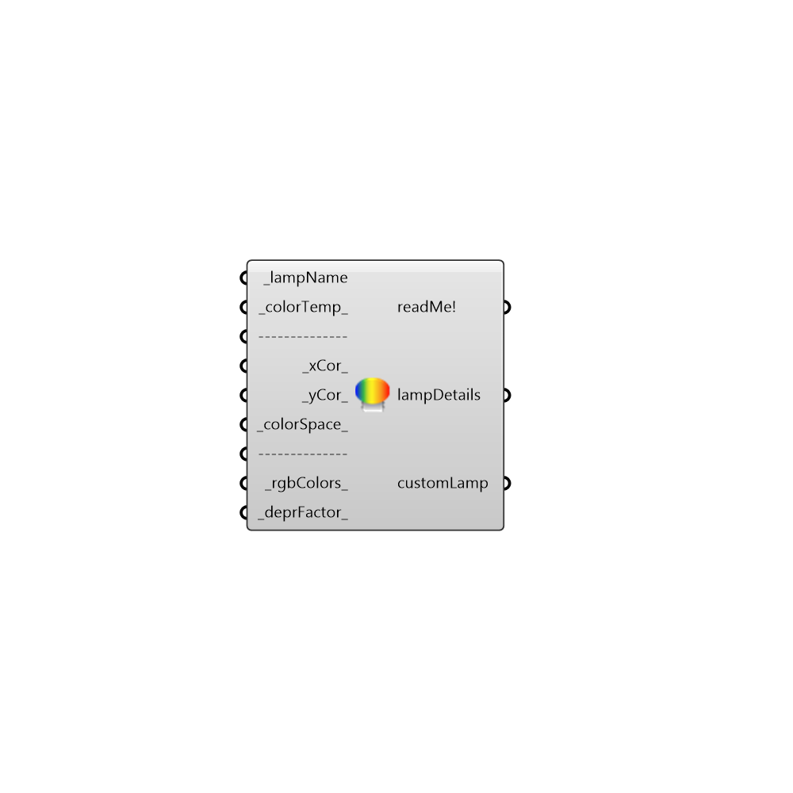

##  IES Custom Lamp - [[source code]](https://github.com/ladybug-tools/honeybee-legacy/tree/master/src/Honeybee_IES%20Custom%20Lamp.py)

This component can be used to specify a lamp of custom chromaticity, color or color temperature. 
 .
 If _lampName is specified from an existing list of lamps (which can be seen by hovering over the _lampName input), then the chromaticity associated with the lamp will be used.
 .
 In case _lampName isn't present in the list,a lamp with chromaticity corresponding to 3200K will be defined.
 .
 If case the custom lamp is being defined by specifying _colorTemp_ or _xCor,_yCor_, it is recommended that the lampDetails output be connected to a text panel for displaying the chromaticity and color temperature of the lamp.
 .
 In case of a conflict, input options on the top will override inputs below them.
 -
 -
 Technical Notes:
 ----------------------
 The Color Matching Functions used for calculations were obtained from Wyszecki, Gunter, and Walter Stanley Stiles. Color science. Vol. 8. New York: Wiley, 1982.
 .
 The calculation of CCT and Duv are based on: Ohno, Yoshi. Practical use and calculation of CCT and Duv. Leukos 10.1 (2014): 47-55.
 .
 CCT calculations should be within +/- 0.1 % margin of error. The Planckian Table used for calculations is based on a 1% step-size.
 .
 While (x,y), (u,v) or (u'v') coordinates may be specified for any valid location on the chromaticity diagram, CCT and Duv will only be displayed if the absolute value of Duv is less than or equal to 0.02.
 .
 .
 !!WARNING !!
 ------------------
 The colors specified in this component only affect the luminance and chromaticity of the light source. 
 The color fidelity or gamut area of the source cannot be modified by this component.
 So, color fidelity metrics such as CRI cannot be considered in these calculations.

#### Inputs
* ##### lampName [Required]
Specify a name for the lamp.The name can be a predefined lamp name or any other name.
 _
 The following lamp names are predefined. The values in parenthesis are the x,y 1931 chromaticity coordinates and lumen depreciation values.:
 clear metal halide    (0.396, 0.39, 0.8)
 cool white            (0.376, 0.368, 0.85)
 cool white deluxe     (0.376, 0.368, 0.85)
 deluxe cool white     (0.376, 0.368, 0.85)
 deluxe warm white     (0.44, 0.403, 0.85)
 fluorescent           (0.376, 0.368, 0.85)
 halogen               (0.4234, 0.399, 1)
 incandescent          (0.453, 0.405, 0.95)
 mercury               (0.373, 0.415, 0.8)
 metal halide          (0.396, 0.39, 0.8)
 quartz                (0.424, 0.399, 1)
 sodium                (0.569, 0.421, 0.93)
 warm white            (0.44, 0.403, 0.85)
 warm white deluxe     (0.44, 0.403, 0.85)
 xenon                 (0.324, 0.324, 1)
 _
 For example,specifying "cool white" (without the quotes) as input will set the x,y,Lumen Depreciation values to 0.376, 0.368 and 0.85 respectively.
 _
 Specifying an arbitrary name like "lampx" will create a lamp with x,y,lumen depreciation values of 0.333,0.333 and 1 respectively. These values can then be modified by specifying _colorTemp_ or _xCor_ and _yCor_ or _rgbColors_.
* ##### colorTemp [Default]
Specify a color temperature for the lamp.The color temperature will be used to calculate the chromatcity coordinates of the lamp on the CIE 1931 xy diagram. Lumen depreciation factor for the lamp can be set by specifying a value for the _deprFactor_ input. Valid values for color temperature are from 1000 to 25000.
* ##### xCor [Default]
Specify a chromaticity coordinate for the lamp. The default coordinate is the x coordinate for the CIE 1931 Color Space.
* ##### yCor [Default]
Specify a chromaticity coordinate for the lamp. The default coordinate is the y coordinate for the CIE 1931 Color Space.
* ##### colorSpace [Default]
Specify a color space for the chromaticity coordinates. The values and their corresponding color spaces are
 0 - CIE 1931 Color Space (default)
 1 - CIE 1960 Color Space
 2 - CIE 1976 Color Space
* ##### rgbColors [Default]
Specify a (r,g,b) color value using either the Grasshopper Colour Swatch (preferred) or a text panel. If the alpha value for the Colour Swatch is set to a value other than 255 then that value will be multiplied with the _deprFactor_.
* ##### deprFactor [Default]
Lamp lumen depreciation factor.

#### Outputs
* ##### readMe!
The execution information, as output and error streams
* ##### lampDetails
Information about the lamp defined as per the input parameters.
* ##### customLamp
Connect this to the customLamp_ input in the Honeybee_IES Luminaire option.

[Check Hydra Example Files for IES Custom Lamp](https://hydrashare.github.io/hydra/index.html?keywords=Honeybee_IES Custom Lamp)