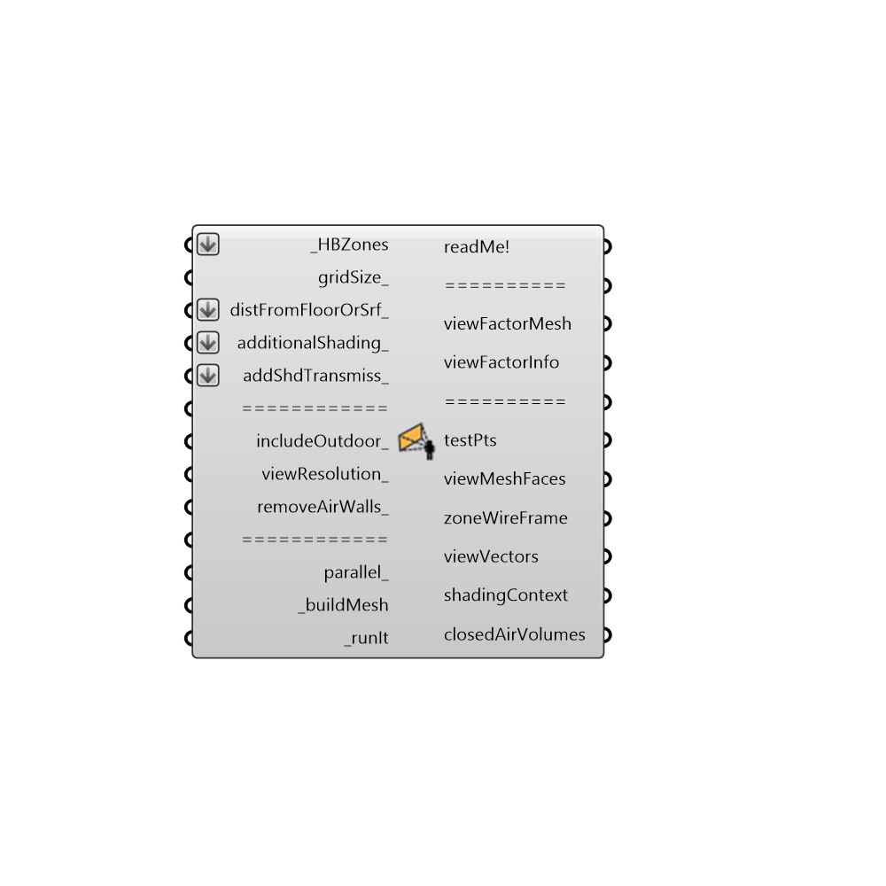

##  Indoor View Factor Calculator - [[source code]](https://github.com/mostaphaRoudsari/honeybee/tree/master/src/Honeybee_Indoor%20View%20Factor%20Calculator.py)

Use this component to generate test points within a zone and calculate the view factor from each of these points to the other zurfaces in a zone as well as the sky.
 _
 This component is a necessary step before creating an thermal map of an energy model.
 -
 

#### Inputs
* ##### HBZones [Required]
The HBZones out of any of the HB components that generate or alter zones.  Note that these should ideally be the zones that are fed into the Run Energy Simulation component as surfaces may not align otherwise.  Zones read back into Grasshopper from the Import idf component will not align correctly with the EP Result data.
* ##### gridSize [Optional]
A number in Rhino model units to make each cell of the view factor mesh.
* ##### distFromFloorOrSrf [Optional]
A number in Rhino model units to set the distance of the view factor mesh from the floor of the zones.  Alternatively, this can be a surface or list of surfaces on which you are interested in studying thermal comfort.  Lastly, it can be a list of points at which you want to evaluate microclimate conditions.
* ##### additionalShading [Optional]
Add additional shading breps or meshes to account for geometry that is not a part of the zone but can still block direct sunlight to occupants.  Examples include outdoor context shading and indoor furniture.
* ##### addShdTransmiss [Optional]
An optional transmissivity that will be used for all of the objects connected to the additionalShading_ input.  This can also be a list of transmissivities whose length matches the number of breps connected to additionalShading_ input, which will assign a different transmissivity to each object.  Lastly, this input can also accept a data tree with a number of branches equal to the number of objects connected to the additionalShading_ input with a number of values in each branch that march the number of hours in the simulated analysisPeriod (so, for an annual simulation, each branch would have 8760 values).  The default is set to assume that all additionalShading_ objects are completely opaque.  As one adds in transmissivities with this input, the calculation time will increase accordingly.
* ##### includeOutdoor [Optional]
Set to 'True' to have the final visualization take the parts of the input Srf that are outdoors and color them with temperatures representative of outdoor conditions.  Note that these colors of conditions will only approximate those of the outdoors, showing the assumptions of the Energy model rather than being a perfectly accurate representation of outdoor conditions.  The default is set to 'False' as the inclusion of outdoor conditions can often increase the calculation time.
* ##### viewResolution [Optional]
An interger between 0 and 4 to set the number of times that the tergenza skyview patches are split.  A higher number will ensure a greater accuracy but will take longer.  The default is set to 0 for a quick calculation.
* ##### removeAirWalls [Optional]
Set to "True" to remove air walls from the view factor calculation.  The default is set to "True" sinc you usually want to remove air walls from your view factor calculations.
* ##### parallel [Optional]
Set to "True" to run the calculation with multiple cores and "False" to run it with a single core.  Multiple cores can increase the speed of the calculation substantially and is recommended if you are not running other big or important processes.  The default is set to "True."
* ##### buildMesh [Required]
Set boolean to "True" to generate a mesh based on your zones and the input distFromFloorOrSrf_ and gridSize_.  This is a necessary step before calculating view factors from each test point to the surrounding zone surfaces.
* ##### runIt [Required]
Set boolean to "True" to run the component and calculate viewFactors from each test point to surrounding surfaces.

#### Outputs
* ##### readMe!
...
* ##### viewFactorMesh
A data tree of breps representing the split mesh faces of the view factor mesh.
* ##### viewFactorInfo
A list of python data that carries essential numerical information for the Comfort Analysis Workflow, including the view factors from each test point to a zone's surfaces, the sky view factors of the test points, and information related to window plaement, used to estimate stratification in the zone.  This should be plugged into a "Comfort Analysis Recipe" component.
* ##### testPts
The test points, which lie in the center of the mesh faces at which comfort parameters are being evaluated.
* ##### viewMeshFaces
Script variable IndoorViewFactor
* ##### zoneWireFrame
A list of curves representing the outlines of the zones.  This is particularly helpful if you want to see the outline of the building in relation to the temperature and comfort maps that you might produce off of these results.
* ##### viewVectors
The vectors that were used to caclulate the view factor (note that these will increase as the viewResolution increases).
* ##### shadingContext
A list of meshes representing the opaque surfaces of the zone.  These are what were used to determine the sky view factor and the direct sun falling on occupants.
* ##### closedAirVolumes
The closed Breps representing the zones of continuous air volume (when air walls are excluded).  Zones within the same breps will have the stratification calculation done together.

[Check Hydra Example Files for Indoor View Factor Calculator](https://hydrashare.github.io/hydra/index.html?keywords=Honeybee_Indoor View Factor Calculator)