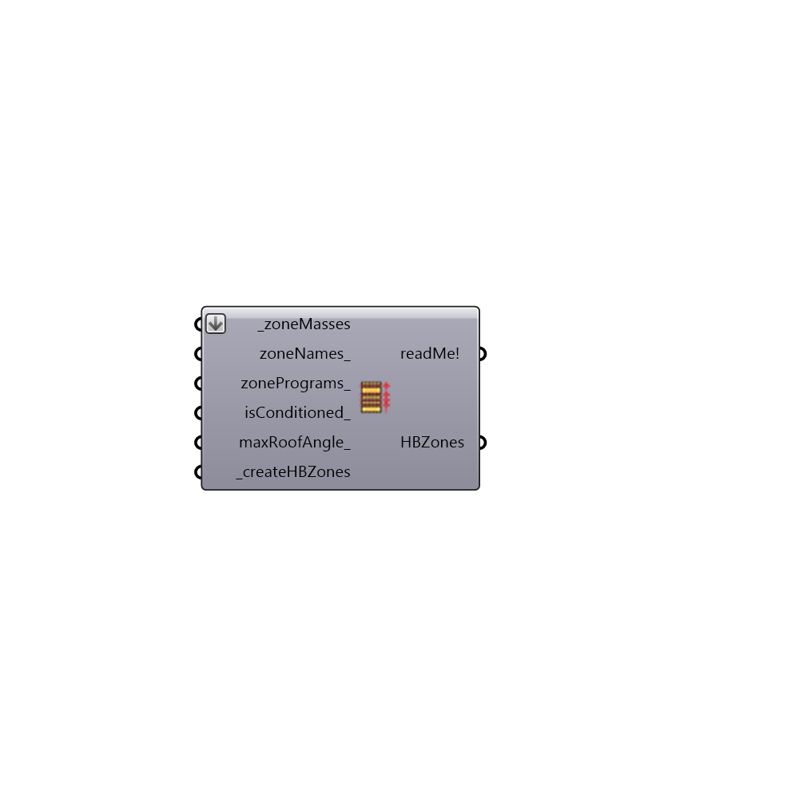

##  Masses2Zones - [[source code]](https://github.com/ladybug-tools/honeybee-legacy/tree/master/src/Honeybee_Masses2Zones.py)

Use this component to take any list of closed breps and turn them into Honeybee Zones with all of the properties needed to run them through an energy simulation.
 _
 This includes constructions of the surfaces, boundary condtions of all of the surfaces (ie ground, exterior, etc), schedules+ loads for occupancy/internal electronics, and settings for an HVAC system if isContitioned_ is set to True.
 -
 

#### Inputs
* ##### zoneMasses [Required]
A list of closed breps or a  single closed brep that represents the geometry of the zone(s) that will be output from this component.
* ##### zoneNames [Optional]
A list of names for the zones that will be output from this component. Default names will be applied to zones based on their order in the list if this value is left empty.
* ##### zonePrograms [Optional]
A list of zone programs from the Honeybee_ListZonePrograms component that matches the number of breps in the _zoneMasses list.  These zone programs will be applied to the zones that are output from this component and will be used to set the shcedules and loads of these programs. This input can also be a single zoneProgram to be applied to all of the coneected zones.  If no value is connected here, the zone program Office::OpenOffice will be applied to the zones.
* ##### isConditioned [Optional]
A list of True/False values that matches the number of breps in the _zoneMasses list. These True/False values will be applied to the ouput zones to either condition them with an Ideal Air Loads System (True) or not condition them at all (False).  This input can also be a single True/False value that can be applied to all of the connected zones.  If no value is connected here, all zones will be conditioned with an Ideal Air Loads System by default.
* ##### maxRoofAngle [Optional]
Maximum angle from z vector that the surface will be assumed as a roof. Default is 30 degrees
* ##### createHBZones [Required]
Set to True to generate the zones and assign energy simulation properties to your connected _zoneMasses.

#### Outputs
* ##### readMe!
...
* ##### HBZones
Honeybee zones that have all of the properties necessary for an energy simulation assigned to them.  Connect these to a "Honeybee_Label Zones" component to see some of these properties.

[Check Hydra Example Files for Masses2Zones](https://hydrashare.github.io/hydra/index.html?keywords=Honeybee_Masses2Zones)