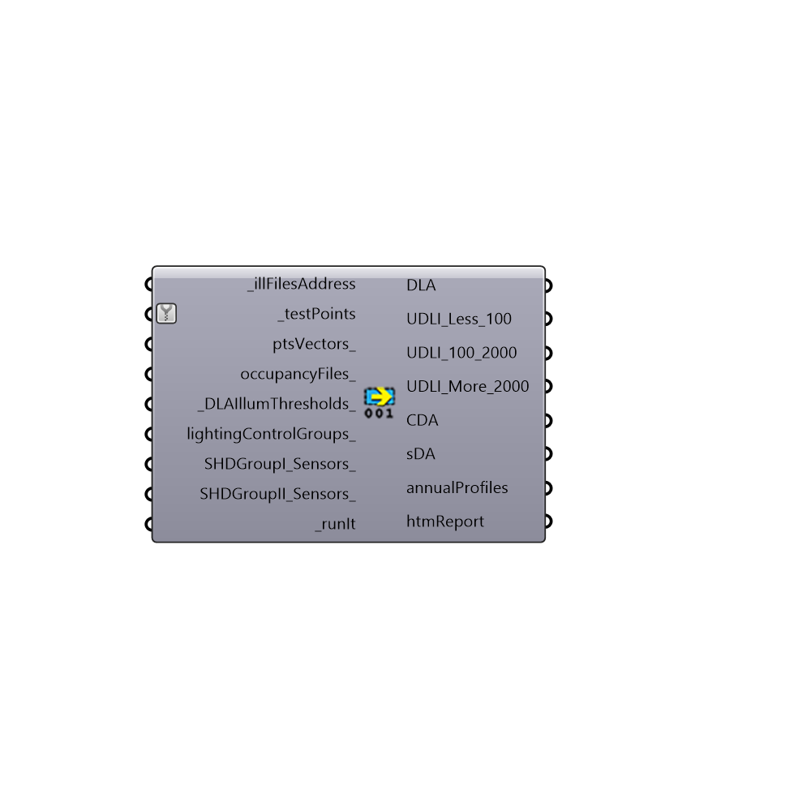

##  Read Annual Result I

Read Annual Daylight Results I [Standard Daysim Results]
 -
 

#### Inputs
* ##### illFilesAddress [Required]
List of .ill files
* ##### testPoints [Required]
List of 3d Points
* ##### ptsVectors [Optional]
Script variable readDSResults
* ##### occupancyFiles [Optional]
Address to a Daysim occupancy file. You can find some example in \Daysim\occ. Use Honeybee Occupancy Generator to generate a custom occupancy file.
* ##### DLAIllumThresholds [Default]
Illuminance threshold for Daylight Autonomy calculation in lux. Default is set to 300 lux.
* ##### lightingControlGroups [Optional]
Daysim lighting control groups. Daysim can model up to 10 lighting control groups together. Default is > cntrlType = 3, lightingPower = 250, lightingSetpoint = 300, ballastLossFactor = 20, standbyPower = 3, delayTime = 5
* ##### SHDGroupI_Sensors [Optional]
Senors for dhading group I. Use shadingGroupSensors component to prepare the inputs
* ##### SHDGroupII_Sensors [Optional]
Senors for dhading group II. Use shadingGroupSensors component to prepare the inputs
* ##### runIt [Required]
set to True to run the analysis

#### Outputs
* ##### DLA
Daylight Autonomy > Percentage of the time during the active occupancy hours that the test point receives more daylight than the illuminance threshold.
* ##### UDLI_Less_100
Useful Daylight illuminance > Percentage of time during the active occupancy hours that the test point receives less than 100 lux.
* ##### UDLI_100_2000
Useful Daylight illuminance > Percentage of time during the active occupancy hours that the test point receives between 100 and 2000 lux.
* ##### UDLI_More_2000
Useful Daylight illuminance > Percentage of time during the active occupancy hours that the test point receives more than 2000 lux.
* ##### CDA
Continuous Daylight Autonomy > Similar to Daylight Autonomy except that the point receives illuminaceLevel/illuminace threshold for hours that illuminance level is less than the threshold.
* ##### sDA
Spatial Daylight Autonomy > sDA is the percent of analysis points across the analysis area that meet or exceed _DLAIllumThresholds value (set to 300 lux for LEED) for at least 50% of the analysis period. Honeybee doesn't consider the effect of dynamic blinds in calculating sDA.
* ##### annualProfiles
A .csv file generated by Daysim that can be used as lighting schedule for annual energy simulation
* ##### htmReport
Script variable readDSResults

[Check Hydra Example Files for Read Annual Result I](https://hydrashare.github.io/hydra/index.html?keywords=Honeybee_Read Annual Result I)