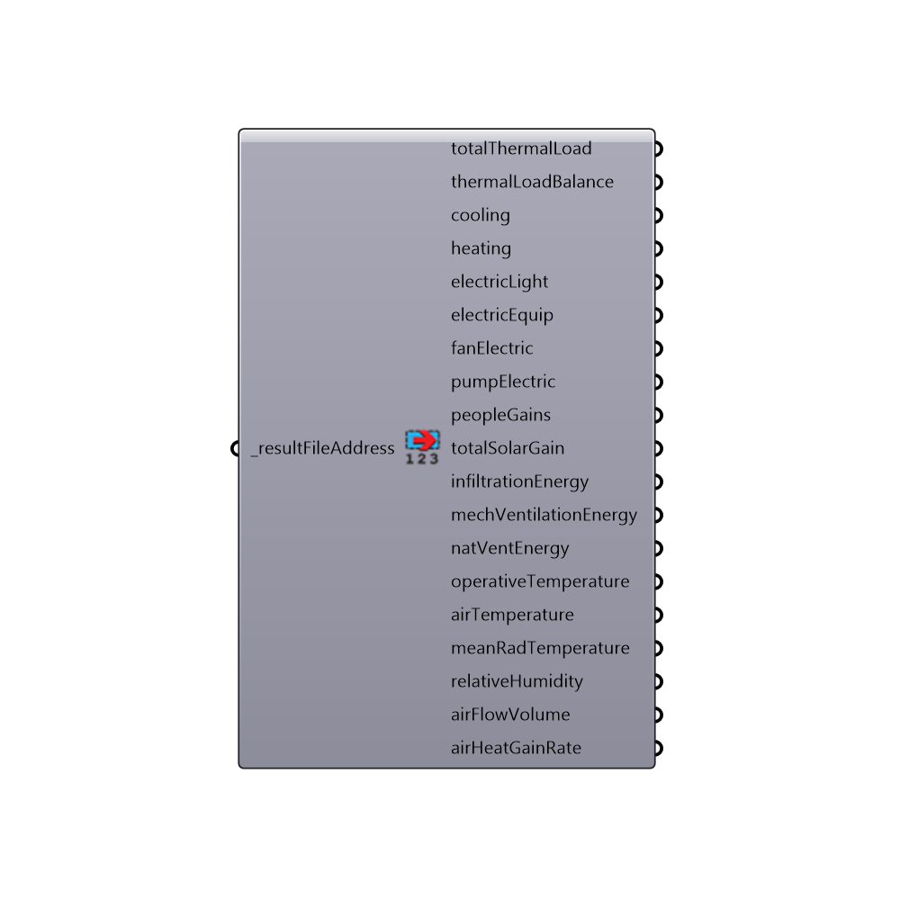

##  Read EP Result - [[source code]](https://github.com/ladybug-tools/honeybee-legacy/tree/master/src/Honeybee_Read%20EP%20Result.py)

This component reads the results of an EnergyPlus simulation from the WriteIDF Component or any EnergyPlus result .csv file address.  Note that, if you use this component without the WriteIDF component, you should make sure that a corresponding .eio file is next to your .csv file at the input address that you specify.
 _
 This component reads only the results related to zones.  For results related to surfaces, you should use the "Honeybee_Read EP Surface Result" component.
 -
 

#### Inputs
* ##### resultFileAddress [Required]
The result file address that comes out of the WriteIDF component.

#### Outputs
* ##### totalThermalLoad
The total thermal energy used by each zone in kWh.  This includes cooling and heating.
* ##### thermalLoadBalance
The thermal energy used by each zone in kWh.  Heating values are positive while cooling values are negative. This is useful for computing balance points.
* ##### cooling
The cooling energy needed in kWh. For Ideal Air loads, this output is the sum of sensible and latent heat that must be removed from each zone.  For detailed HVAC systems (other than ideal air), this output will be electric energy needed to power each chiller/cooling coil.
* ##### heating
The heating energy needed in kWh. For Ideal Air loads, this is the heat that must be added to each zone.  For detailed HVAC systems (other than ideal air), this will be fuel energy or electric energy needed for each boiler/heating element.
* ##### electricLight
The electric lighting energy needed for each zone in kWh.
* ##### electricEquip
The electric equipment energy needed for each zone in kWh.
* ##### fanElectric
The fan electric energy in kWh for either a natural ventilation fan or a heating or cooling system fan.  This ouput will not appear when there is no fan in the model.
* ##### pumpElectric
The water pump electric energy in kWh for a heating or cooling system.  This ouput will not appear when there is no water pump in the model.
* ##### peopleGains
The internal heat gains in each zone resulting from people (kWh).
* ##### totalSolarGain
The total solar gain in each zone(kWh).
* ##### infiltrationEnergy
The heat loss (negative) or heat gain (positive) in each zone resulting from infiltration (kWh).
* ##### mechVentilationEnergy
The heat loss (negative) or heat gain (positive) in each zone resulting from the outdoor air coming through the HVAC System (kWh).
* ##### natVentEnergy
The heat loss (negative) or heat gain (positive) in each zone resulting from natural ventilation (kWh).
* ##### operativeTemperature
The mean operative temperature of each zone (degrees Celcius).
* ##### airTemperature
The mean air temperature of each zone (degrees Celcius).
* ##### meanRadTemperature
The mean radiant temperature of each zone (degrees Celcius).
* ##### relativeHumidity
The relative humidity of each zone (%).
* ##### airFlowVolume
The total volume of air flowing into the room through both the windows and infiltration (m3/s).  This is voulme of air is at standard density (20 C and adjusted for the elevation above sea level of the weather file).
* ##### airHeatGainRate
The total heat transfer rate to the air from lighting, equipment(appliances/pulg loads), people, the surfaces of the zone, and gains through the heating system.  This output is useful for the estimation of air stratification in the Comfort Analysis workflow.

[Check Hydra Example Files for Read EP Result](https://hydrashare.github.io/hydra/index.html?keywords=Honeybee_Read EP Result)