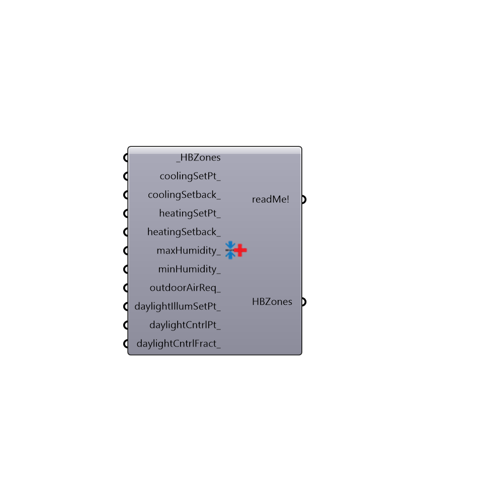

##  Set EnergyPlus Zone Thresholds

Use this component to set Zone Thresholds like daylighting thresholds and setpoints.
 -
 

#### Inputs
* ##### HBZones [Required]
HBZones for which zone thresholds will be set.
* ##### coolingSetPt [Optional]
A number or list of numbers that represent the thermostat cooling setpoint in degrees Celcius.  The cooling setpoint is effectively the indoor temperature above which the cooling system is turned on.  This can be either a single number to be applied to all connected zones or a list of numbers for each different zone.
* ##### coolingSetback [Optional]
A number or list of numbers that represent the thermostat cooling setback in degrees Celcius.  The cooling setback is the indoor temperature that the space will be kept at when it is unoccipied.  Note that not all building types have a setback.  This can be either a single number to be applied to all connected zones or a list of numbers for each different zone.
* ##### heatingSetPt [Optional]
A number or list of numbers that represent the thermostat heating setpoint in degrees Celcius.  The heating setpoint is effectively the indoor temperature below which the heating system is turned on.  This can be either a single number to be applied to all connected zones or a list of numbers for each different zone.
* ##### heatingSetback [Optional]
A number or list of numbers that represent the thermostat heating setback in degrees Celcius.  The heating setback is the indoor temperature that the space will be kept at when it is unoccipied.  Note that not all building types have a setback.  This can be either a single number to be applied to all connected zones or a list of numbers for each different zone.
* ##### maxHumidity [Optional]
A number or list of numbers that represent the maximum relative humidity allowed by a humidistat in %.  The HVAC will dehumidify the zone air  if the relative humidity goes above this threshold.  The default is set to 'no limit' or no humidistat. This can be either a single number to be applied to all connected zones or a list of numbers for each different zone.
* ##### minHumidity [Optional]
A number or list of numbers that represent the minimum relative humidity allowed by a humidistat in %.  The HVAC will humidify the zone air if the relative humidity goes below this threshold.  The default is set to 'no limit' or no humidistat. This can be either a single number to be applied to all connected zones or a list of numbers for each different zone.
* ##### outdoorAirReq [Optional]
An integer or text string value that changes the outdoor air requirement of the zone (the default is set to "0 - Sum").  Choose from the following options:
 0 - Sum - The outdoor air coming through the mechnical system will be the sum of the specified flow/m2 of zone floor area and the flow/person.  This is the default and is the usual recommendation of ASHRAE.
 1 - Maximum - The outdoor air coming through the mechnical system will be either the specified flow/m2 of zone floor area or the flow/person (depending on which is larger at a given hour).   Choosing this option effectively implies that there is a demand-controlled ventilation system set up in the zone.
 2 - None - No outdoor air will come through the mechanical system and the heating/cooling will be applied only through re-circulation of indoor air.  Be careful as this option might not bring enough fresh air to occupants if the zone's infiltration is very low.

#### Outputs
* ##### readMe!
The execution information, as output and error streams
* ##### HBZones
HBZones with thresolds set.

[Check Hydra Example Files for Set EnergyPlus Zone Thresholds](https://hydrashare.github.io/hydra/index.html?keywords=Honeybee_Set EnergyPlus Zone Thresholds)