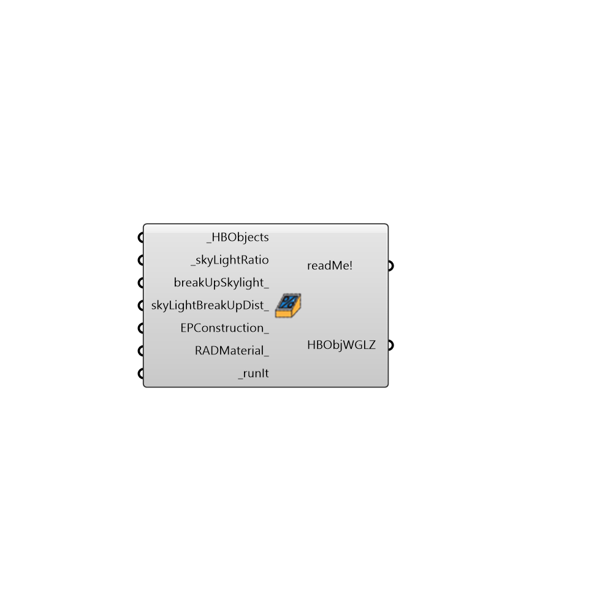

##  Skylight Based on Ratio - [[source code]](https://github.com/ladybug-tools/honeybee-legacy/tree/master/src/Honeybee_Skylight%20Based%20on%20Ratio.py)

Use this component to generate windows for a HBSurface or HBZone based on a desired window-to-wall ratio. In addition to generating window geometry that corresponds with the input ratio, this component also allows you a fairly high level of control over the window geometry.
 _
 The first way in which you gain additional control over geometry is the option of whether you want to generate a single window for each surface, which is good for making energy simulations run fast, or you want to use the glazig ratio to create several windows distributed across the surfaces, which is often necessary to have accurate daylight simulations or high-resolution thermal maps.
 If you break up the window into several ones, you also have the ability to set the distance between each of the windows along the surface.
 _
 If you input wall surfaces that have perfectly horizontal tops and/or bottoms, you also have access to a number of other other inputs such as window height, the sill height, and whether you want to split the glazing vertically into two windows.
 -
 

#### Inputs
* ##### HBObjects [Required]
Honeybee thermal zones or surfaces for which glazing should be generated.
* ##### skyLightRatio [Required]
If you have input a full zone or roof surface as your HBObjects, use this input to generate skylights on the roof surfaces. A single window for each surface is good for making energy simulations run fast while several distributed windows is often necessary to have accurate daylight simulations or high-resolution thermal maps. The default is set to "True" to generate multiple distributed windows.
* ##### breakUpSkylight [Optional]
Set to "True" to generate a distributed set of multiple windows for skylights and set to "False" to generate just a single window per roof surface.
* ##### skyLightBreakUpDist [Optional]
An optional number in Rhino model units that sets the distance between individual skylights when the breakUpSkylight_ input above is set to 'True'.  The default is set to 3 meters.
* ##### EPConstruction [Optional]
A optional text string of an EnergyPlus construction name that sets the material construction of the window. The default will assign a generic double pane window without low-e coatings.
* ##### RADMaterial [Optional]
A optional text string of an Radiance glass material name that sets the material of the window.
* ##### runIt [Required]
set runIt to True to generate the glazing

#### Outputs
* ##### readMe!
...
* ##### HBObjWGLZ
Newhoneybee zones that contain glazing surfaces based on the parameters above. 

[Check Hydra Example Files for Skylight Based on Ratio](https://hydrashare.github.io/hydra/index.html?keywords=Honeybee_Skylight Based on Ratio)