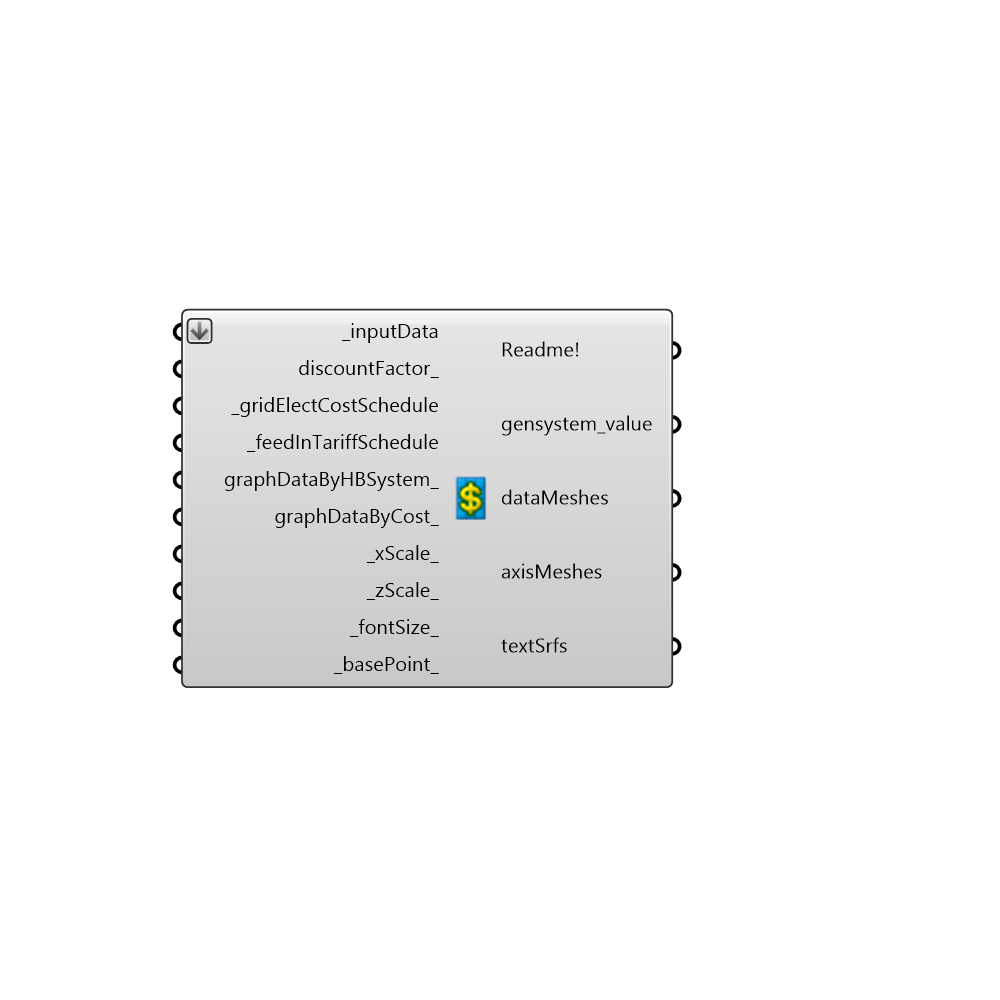

##  Visualise_Honeybeegeneration_cashflow - [[source code]](https://github.com/mostaphaRoudsari/honeybee/tree/master/src/Honeybee_Visualise_Honeybeegeneration_cashflow.py)

Use this component to the calculate and visualise the financial value of Honeybee generation systems over 25 years. At present you can only create grid connected renewable energy systems without storage. For this reason you must specify both the grid electricity price and fed in tariff rate.
 -
 The financial value of the Honeybee generator systems is calculated by calculating how much energy is consumed by the facility and produced by the Honeybee generator systems for every hour of the year.
 -
 For every hour of the year if electricity is generated and the facility requires electricity, the facility will automatically consume the electricity generated. This will generate a revenue as the facility did not have to purchase electricity from the grid.
 -
 Any surplus electricity generated in any hour throughout the year will be fed back into the grid at the tariff rate, and generate a revenue.
 -
 

#### Inputs
* ##### inputData [Required]
To use this component please input all the outputs from the component readEP_generation_system_results here
* ##### discountFactor [Optional]
An optional input - specify the interest rate as a percentage to calculate a discount factor for each Honeybee generation system. A discount factor is a ratio used to calculate the present value of a future revenue or cost that occurs in any year of the system lifetime (25 years) using the equation - fd = 1/(1+i)^N where: i = real interest rate ,N = number of years. If this field is left blank no discount factor will be applied
* ##### gridElectCostSchedule [Required]
The cost of grid connected electricty per Kwh in US dollars
 If you want to specify a flat rate just specify one value this will be used across all the hours of the year.
 Otherwise specify the grid electricity cost for 288 hours of the year that is for each hour of the day for one day in every month of the year.
 Use a list with 288 values to do this.
* ##### feedInTariffSchedule [Required]
The price that the utility will pay per Kwh in US dollars for power fed back into the grid. 
 If you want to specify a flat rate just specify one value this will be used across all the hours of the year.
 Otherwise specify the grid electricity cost for 288 hours of the year that is for each hour of the day for one day in every month of the year.
 Use a list with 288 values to do this.
* ##### graphDataByHBSystem [Optional]
Set to True to visualise the the financial value of each Honeybee generation system.
* ##### graphDataByCost [Optional]
Set to True to sum each Honeybee generation system's costs and revenues together and then to visualise these figures by type e.g replacement costs, capital costs etc.
 to visualise each generator system by cost run mutliple Energy Plus simulations and visualise results seperately.
* ##### xScale [Default]
The scale of the X axis of the graph. The default will plot the X axis with a length of 215 Rhino model units 
* ##### zScale [Default]
The scale of the Y axis of the graph. The default will plot the Z axis with a length of 85 Rhino model units 
* ##### fontSize [Default]
An optional input, use a float to change the size of the font on the graph.
* ##### basePoint [Default]
An optional input, use a 3D point to locate the 3D chart in the Rhino Model.  The default is set to the Rhino origin at (0,0,0).

#### Outputs
* ##### Readme!
The execution information, as output and error streams
* ##### gensystem_value
The net present cost of each Honeybee generation system. The net present cost is the present value of all the costs of installing and operating that Honeybee generation system over 25 years minus the present value of the all the revenues that the system earns over 25 years. 
 Thus a positive value means that compared to just buying electricity from the grid the Honeybee generation system will save money while a negative value means that it will be more cost effective to simply buy electricity from the grid.
* ##### dataMeshes
Script output dataMeshes.
* ##### axisMeshes
Script variable HB_GeneratorCashflow
* ##### textSrfs
Script output textSrfs.

[Check Hydra Example Files for Visualise_Honeybeegeneration_cashflow](https://hydrashare.github.io/hydra/index.html?keywords=Honeybee_Visualise_Honeybeegeneration_cashflow)