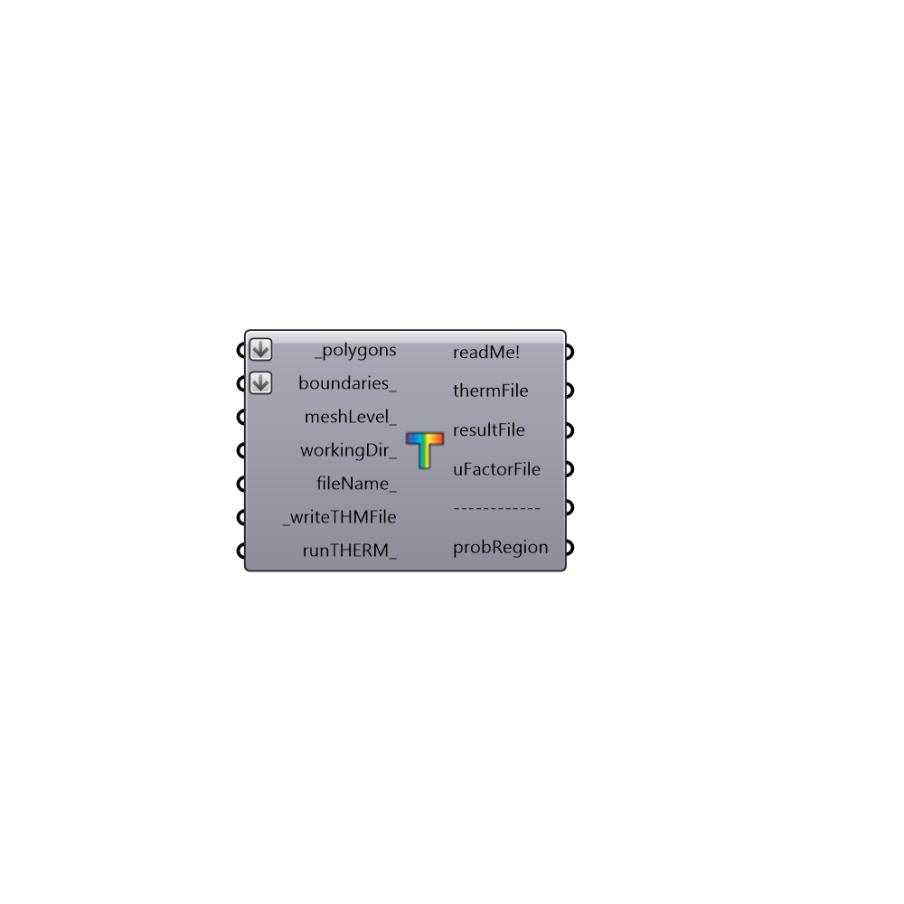

##  Write THERM File

Use this component to write your THERM polygons and boundary conditions into a therm XML that can be opened ready-to-run in THERM.
 -
 

#### Inputs
* ##### polygons [Required]
A list of thermPolygons from one or more "Honeybee_Create Therm Polygons" components.
* ##### boundaries [Required]
A list of thermBoundaries from one or more "Honeybee_Create Therm Boundaries" components.
* ##### meshLevel [Optional]
An optional integer to set the mesh level of the resulting exported file.  The default is set to a coarse value of 6 but it may be necessary to increase this if THERM tells you to 'increase the quad tree mesh parameter in the file'.
* ##### workingDir [Optional]
An optional working directory to a folder on your system, into which you would like to write the THERM XML and results.  The default will write these files in into your Ladybug default folder.  NOTE THAT DIRECTORIES INPUT HERE SHOULD NOT HAVE ANY SPACES OR UNDERSCORES IN THE FILE PATH.
* ##### fileName [Optional]
An optional text string which will be used to name your THERM XML.  Change this to aviod over-writing results of previous runs of this component.
* ##### writeTHMFile [Required]
Script variable Python

#### Outputs
* ##### readMe!
...
* ##### thermFile
Script variable Python
* ##### uFactorFile
Script variable writeTHERM
* ##### resultFile
The location where the THERM results will be written once you open the XML file above in THERM and hit "simulate."

[Check Hydra Example Files for Write THERM File](https://hydrashare.github.io/hydra/index.html?keywords=Honeybee_Write THERM File)