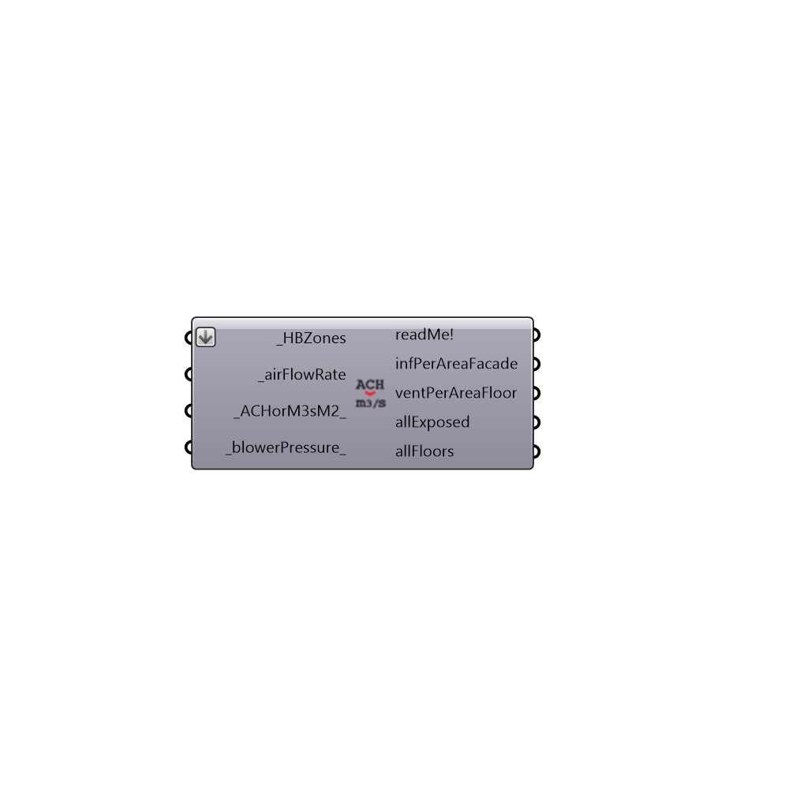

##  infORventPerArea Calculator - [[source code]](https://github.com/mostaphaRoudsari/honeybee/tree/master/src/Honeybee_infORventPerArea%20Calculator.py)

Use this component to transform ACH or inifitration per area of facade to m3/s-m2.
 Plug the result to the Honeybee setEPZoneLoads component, infiltrationRatePerArea_ or  infiltrationRatePerArea_ inputs
 For the blowerPressue input, the component assumes a natural pressure differential between indoors and outdoors at 4 Pascals.  However, the passive house standard sets this at a low 0.4303.
 -
 

#### Inputs
* ##### HBZones [Required]
Honeybee zones for which you want to calculate the infiltration or ventilation rates.
* ##### airFlowRate [Required]
A number representing the air flow rate into the HBZone in Air Changes per Hour (ACH).  Alternatively this number can be in m3/s per m2 of exposed envelope area if the input below is set to "False."  The latter is useful for infiltration, which is typically specified as a unit per area of exposed envelope.
* ##### ACHorM3sM2 [Default]
Set to "True" to have the airFlowRate above interpreted as ACH. Set to "False" to have itinterpreted as m3/s per m2 of outdoor-exposed zone surface area.  This latter is useful for infiltration rates, which are usually defined as an intensity of flow per unit outdoor exposure.  The default is set to True for ACH.
* ##### blowerPressure [Default]
A number representing the pressure differential in Pascals (Pa) between indoors/outdoors at which the specified flow rate above occurs.  When set to 0 or left untouched, the specified input flow rate to this component will be the same as that output from the component (only the units will be converted and no translation from one pressure to another will occur).  However, many blower door tests for infiltration occur at higher pressure differentials of 50 Pa or 75 Pa.  You can input this pressure differential here in order to convert the flow rate of this blower door test to typical building pressure flow rates of 4 Pa.

#### Outputs
* ##### readMe!
Report of the calculations
* ##### infORventPerArea
infiltrationRatePerArea or ventilationPerArea in m3/s-m2 (Cubic meters per second per square meter of floor area) that can be plugged into the "Set EnergyPlus Zone Loads" component.
* ##### allFloors
The floors of the zones that are used to determine the infORventPerArea.
* ##### allExposed
If _ACHorM3sM2_ is set to "False", the area of the zone that is interpreted as exposed srface area will be output here.

[Check Hydra Example Files for infORventPerArea Calculator](https://hydrashare.github.io/hydra/index.html?keywords=Honeybee_infORventPerArea Calculator)